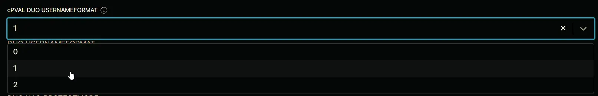

## Summary

The username format sent to Duo. One of: 0 for sAMAccountName (narroway), 1 for the NTLM domain and username (ACME\narroway), or 2 for the userPrincipalName (narroway@acme.corp)

## Details

| Label | Field Name | Definition Scope | Type | Option Value | Default Value | Required  | Technician Permission | Automation Permission | API Permission | Description | Tool Tip | Footer Text | Custom Field Tab Name |  
| ----- | ---------- | ---------------- | ---- | ------------ | ------------- | --------- | --------------------- | --------------------- | -------------- | ----------- | -------- | ----------- | ----- |
| cPVAL DUO USERNAMEFORMAT | cpvalDuoUsernameformat | Organization | drop-down | `0`, `1`, `2` | `1` | False | Editable | Read/Write | Read/Write | The username format sent to Duo. One of: 0 for sAMAccountName (narroway), 1 for the NTLM domain and username (ACME\narroway), or 2 for the userPrincipalName (narroway@acme.corp) | Select the username format to send to DUO. Default is 1 | DUO USERNAMEFORMAT | DUO |

## Dependencies

- [Solution - Duo Deployment](/docs/a11cd829-a491-4cb1-a7c1-3f56fa8c7557)

## Custom Field Creation

- [Custom Field Configuration](https://github.com/ProVal-Tech/ninjarmm/blob/main/custom-fields/cpval-duo-username-format.toml)

## Sample Screenshot

## Changelog

### 2026-05-25

* Updated the documentation to align with the new documentation format and standards.

### 2025-04-15

- Initial version of the document
