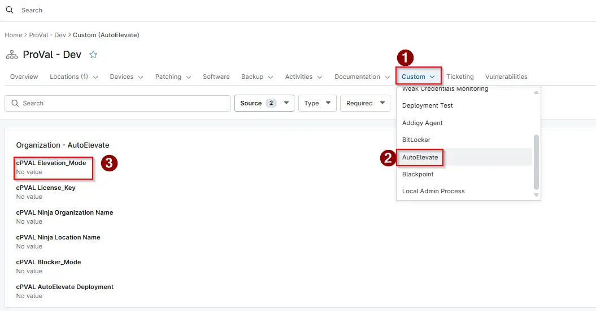

## Summary

Elevation Mode is a configuration parameter used during the AutoElevate agent deployment. It determines how privilege elevation requests are handled on the device once the agent is installed

## Details

| Label                          | Field Name                 | Definition Scope | Type | Required | Default Value | Technician Permission | Automation Permission | API Permission | Description                             | Tool Tip | Footer Text | Custom Field Tab Name |
| ------------------------------ | -------------------------- | ---------------- | ---- | -------- | ------------- | --------------------- | --------------------- | -------------- | --------------------------------------- | -------- | ----------- | --------------------- |
| cPVAL Elevation_Mode | cpvalElevationmode | `Organization`, `Location`, `Device`     | Text | No     | -             | Editable              | Read/Write            | Read/Write     | Used to hold the elevation mode data that is used within the script. | Elevation Mode       | Elevation Mode         | AutoElevate     |

## Dependencies

- [AutoElevate Agent Deployment](/docs/45b83c20-5a25-4321-a253-5239633ecbd4)

## Custom Field Creation

- [Custom Field Configuration](https://github.com/ProVal-Tech/ninjarmm/blob/main/custom-fields/cpval-elevation-mode.toml)

## Sample Screenshot

