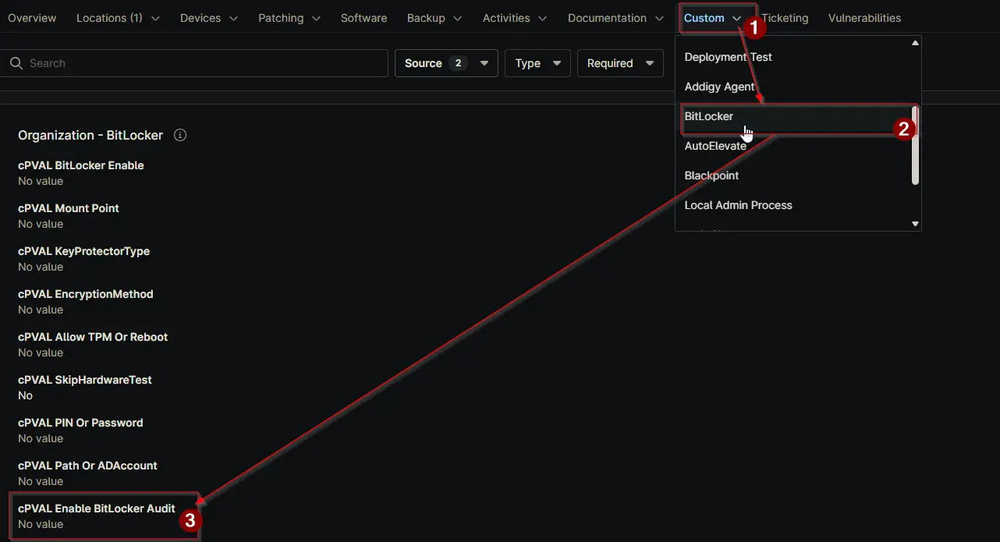

## Summary

Select the operating system for which BitLocker auditing should be enabled. Use this setting to specify the OS where auditing policies will apply.

## Details

| Label | Field Name | Definition Scope | Type | Required | Available Options | Technician Permission | Automation Permission | API Permission | Description | Tool Tip | Footer Text | Custom Field Tab Name |
| ----- | ---- | ---------------- | ---- | -------- | ------------- | --------------------- | --------------------- | -------------- | ----------- | -------- | ----------- | ----------- |
| cPVAL Enable BitLocker Audit | cpvalEnableBitlockerAudit | `Organizations`,`Devices`,`Location` | Drop-down | `true` | `Windows`, `Windows Servers`, `Windows Workstations`, `Disable` | Editable | Read_Write | Read_Write | Select the operating system for which BitLocker auditing should be enabled. Use this setting to specify the OS where auditing policies will apply. | Choose the OS to enable BitLocker auditing. Select Disable at the location or device level to exclude it from auditing. | Note: If you select Disable at any location or device level, BitLocker auditing will not apply to that scope. | BitLocker |

## Dependencies

- [Solution: BitLocker and TPM Audit](/docs/57c787ad-8d22-4ae4-b5e5-dac34fc600fc)

## Custom Field Creation

[Custom Field Configuration](https://github.com/ProVal-Tech/ninjarmm/blob/main/custom-fields/cpval-enable-bitlocker-audit.toml)

## Sample Screenshot

