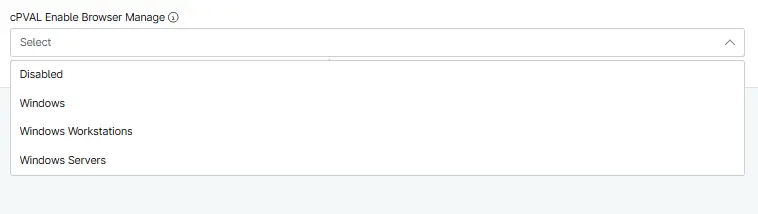

## Summary
Custom Field to select the operating system to manage the Browser homepage for the machines.

## Details

| Label | Field Name | Definition Scope | Type | Required | Default Value | Options | Technician Permission | Automation Permission | API Permission | Custom Field Tab Name |
| ----- | ---- | ---------------- | ---- | -------- | ------------- | ------------- | --------------------- | --------------------- | -------------- | ----------- |
| cPVAL Enable Browser Manage | cpvalEnableBrowserManage | `Organization`, `Location`, `Device` | Drop-down | False | | <ul><li>Disabled</li><li>Windows Workstations</li><li>Windows Server</li><li>Windows</li></ul> | Editable | Read_Write | Read_Write | Manage Browser HomePage |

## Dependencies

- [Solution - Browser - HomePage - Manage](/docs/3197b1ea-9250-4373-9d21-6124a0b72ec6)

## Custom Field Creation

- [Custom Field Configuration](https://github.com/ProVal-Tech/ninjarmm/blob/main/custom-fields/cpval-enable-browser-manage.toml)

## Sample Screenshot

## Changelog

### 2026-10-01

- Initial version of the document
