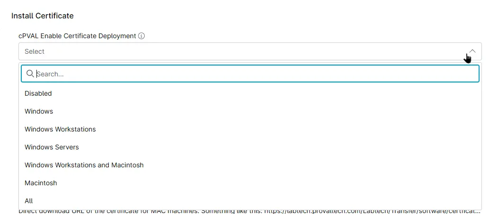

## Summary
Custom Field to select the operating systems on which the certificate should be deployed.

## Details

| Label | Field Name | Definition Scope | Type | Required | Default Value | Options | Technician Permission | Automation Permission | API Permission | Description | Tool Tip | Footer Text |  Custom Field Tab Name |
| ----- | ---- | ---------------- | ---- | -------- | ------------- | ------------- | --------------------- | --------------------- | -------------- | ----------- | -------- | ----------- | ----------- |
| cPVAL Enable Certificate Deployment | cpvalEnableCertificateDeployment | `Organization`, `Location`, `Device` | Drop-down | False | | <ul><li>Disabled</li><li>Windows Workstations</li><li>Windows Server</li><li>Windows</li><li>Windows Workstations and Macintosh</li><li>Macintosh</li><li>All</li></ul> | Editable | Read_Write | Read_Write | Select the operating systems on which the certificate should be deployed. | Select the operating systems on which the certificate should be deployed. | Select the operating systems on which the certificate should be deployed. | Install Certificate |

## Dependencies

- [Solution - Install Certificates - Windows/Mac](/docs/12034de3-aa3a-4f6c-89da-a6f229e6fbec)

## Custom Field Creation

- [Custom Field Configuration](https://github.com/ProVal-Tech/ninjarmm/blob/main/custom-fields/cpval-enable-certificate-deployment.toml)

## Sample Screenshot

## Changelog

### 2026-09-28

- Initial version of the document