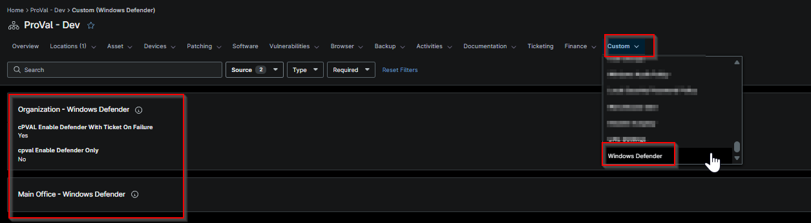

## Summary

This custom field is designed to enable Windows Defender and set up automation for ticket creation for the failure.

## Details

| Label | Field Name | Example | Definition Scope | Type | Default Value |  Editable | Custom Field Tab |
| ----- | ---------- | ------- | ---------------- | ---- | -------- | ------------- | ---------------- | 
| cPVAL Enable Defender With Ticket On Failure | cpvalEnableDefenderWithTicketOnFailure | True | `Organization` | Checkbox |  |   Yes | Windows Defender |

## Dependencies

- [Solution - Enable Defender](/docs/265e1888-ce5f-4d44-a5c4-6a64d578eb98)

## Custom Field Creation

- [Custom Field Configuration](https://github.com/ProVal-Tech/ninjarmm/blob/main/custom-fields/cpval-enable-defender-with-ticket-on-failure.toml)

## Sample Screenshot

## Changelog

### 2026-10-09

- Initial version of the document