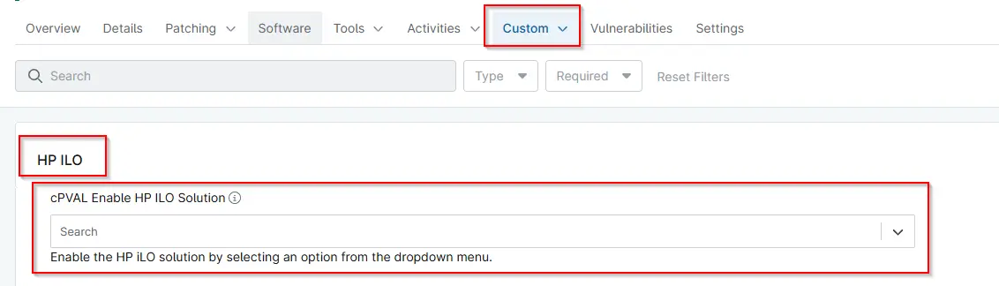

## Summary
Custom Field to enable the HP iLO solution by selecting an option from the dropdown menu. Auditing performs an audit of HP iLO devices. Monitoring checks HP iLO devices for any unhealthy or degraded status. Both enables both auditing and monitoring functions. 

## Details

| Label | Field Name | Definition Scope | Type | Required | Default Value | Technician Permission | Automation Permission | API Permission | Description | Tool Tip | Footer Text |  Custom Field Tab Name |
| ----- | ---- | ---------------- | ---- | -------- | ------------- | --------------------- | --------------------- | -------------- | ----------- | -------- | ----------- | ----------- |
| cPVAL Enable HP ILO Solution | cpvalEnableHpIloSolution | Device | Dropdown | False | None | Editable | Read_Write | Read_Write | Enable the HP iLO solution by selecting an option from the dropdown menu. Auditing performs an audit of HP iLO devices. Monitoring checks HP iLO devices for any unhealthy or degraded status. Both enables both auditing and monitoring functions.  | Enable the HP iLO solution by selecting an option from the dropdown menu. | Enable the HP iLO solution by selecting an option from the dropdown menu. | HP iLO|

## Available Options

| Option | Description |
| ----- | -------- |
| Auditing | Audits and writes an HTML health report to the configured Ninja custom field. |
| Monitoring | Evaluates the returned health data and writes a summarized status value |
| Both | Performs both Auditing and Monitoring |
| None | Refrains from performing any task. |

## Dependencies

- [Solution - HP iLO Health Check](/docs/593be8f7-970f-4b6a-80b0-7cf0ff3396a6) 

## Custom Field Creation

- [Custom Field Configuration](https://github.com/ProVal-Tech/ninjarmm/blob/main/custom-fields/cpval-enable-hp-ilo-solution.toml)

## Sample Screenshot

## Changelog

### 2026-04-09

- Initial version of the document
