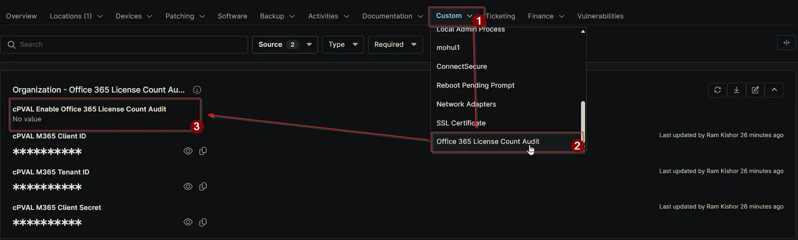

## Summary

Flag this checkbox to enable Office 365 license count auditing for the client. Once enabled, the auditing script will run daily against the client's primary domain controller to collect and store license usage data.

## Details

| Label | Field Name | Definition Scope | Type | Required | Default Value | Technician Permission | Automation Permission | API Permission | Description | Tool Tip | Footer Text | Custom Field Tab Name |
| ----- | ---- | ---------------- | ---- | -------- | ------------- | --------------------- | --------------------- | -------------- | ----------- | -------- | ----------- | ----------- |
| cPVAL Enable Office 365 License Count Audit | cpvalEnableOffice365LicenseCountAudit | `Organization` | Checkbox | True (for enabling Automation) | | Editable | Read_Write | Read_Write | Flag this checkbox to enable Office 365 license count auditing for the client. Once enabled, the auditing script will run daily against the client's primary domain controller to collect and store license usage data. | Enable daily Office 365 license count audits. The script runs on the client's primary domain controller to track and store assigned licenses. | When selected, the system will execute a daily audit script against the client's primary domain controller to monitor and report Office 365 license counts. | Office 365 License Count Audit |

## Dependencies

- [Solution: Office 365 License Count Audit](/docs/4967b45b-e903-4176-ae5f-c4e095b5cdc5)

## Custom Field Creation

- [Custom Field Configuration](https://github.com/ProVal-Tech/ninjarmm/blob/main/custom-fields/cpval-enable-office-365-license-count-audit.toml)

## Sample Screenshot

## Changelog

### 2026-02-26

- Initial version of the document
