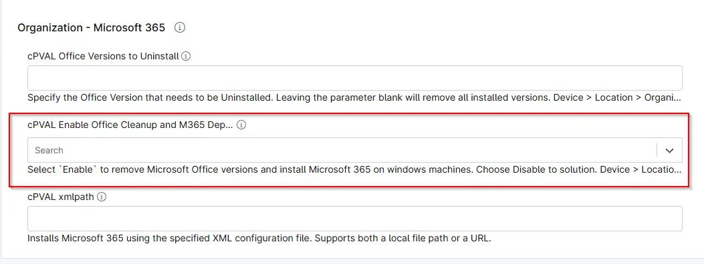

## Summary
Custom field to enable/disable the office cleanup and M365 Deployment. 

## Details

| Label | Field Name | Definition Scope | Type | Required | Default Value | Technician Permission | Automation Permission | API Permission | Description | Tool Tip | Footer Text |  Custom Field Tab Name |
| ----- | ---- | ---------------- | ---- | -------- | ------------- | --------------------- | --------------------- | -------------- | ----------- | -------- | ----------- | ----------- |
| cPVAL Enable Office Cleanup and M365 Deployment | cpvalEnableOfficeCleanupAndM365Deployment | Device/Location/Organization | Drop Down | false | - | Editable | Read_Write | Read_Write | Select `Enable` to remove Microsoft Office versions and install Microsoft 365 on windows machines. Choose Disable to solution. Device > Location > Organization in precedence. | Select `Enable` to remove Microsoft Office versions and install Microsoft 365 on windows machines. Choose Disable to solution. Device > Location > Organization in precedence. | Select `Enable` to remove Microsoft Office versions and install Microsoft 365 on windows machines. Choose Disable to solution. Device > Location > Organization in precedence.| Microsoft 365 |

## Dependencies

- [Solution: Office Cleanup and M365 Deployment](/docs/f5efe485-4c55-4fe0-88db-05c06305b101)

## Custom Field Creation

- [Custom Field Configuration](https://github.com/ProVal-Tech/ninjarmm/blob/main/custom-fields/cpval-enable-office-cleanup-n-m365-deployment.toml)

## Sample Screenshot

## Changelog

### 2026-30-04

- Initial version of the document