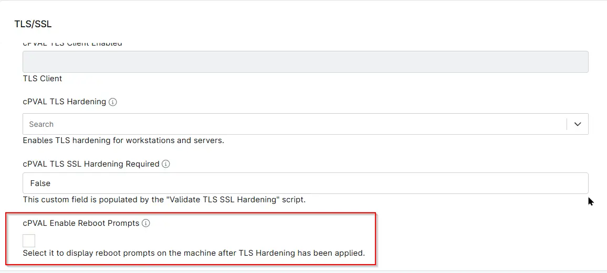

## Summary
Enables reboot prompts following TLS Hardening. Requires the [Solution - Reboot Pending Prompt](/docs/d7758fa4-9fcc-4259-a7a5-0ca65dda10eb)  to be enabled in the environment.

## Details

| Label | Field Name | Definition Scope | Type | Required | Default Value | Options | Technician Permission | Automation Permission | API Permission | Description | Tool Tip | Footer Text |  Custom Field Tab Name |
| ----- | ---- | ---------------- | ---- | -------- | ------------- | ------------- | --------------------- | --------------------- | -------------- | ----------- | -------- | ----------- | ----------- |
| cPVAL Enable Reboot Prompts | cpvalEnableRebootPrompts | `Organization`,`Location`,`Device` | CheckBox | False | - | - | Editable | Read_Write | Read_Write | Enables reboot prompts following TLS Hardening. Requires the Reboot Pending Prompt solution to be enabled in the environment. | Select it to display reboot prompts on the machine after TLS Hardening has been applied. Requires the 'Reboot Pending Prompt solution' to be enabled in the environment. | Select it to display reboot prompts on the machine after TLS Hardening has been applied.| TLS/SSL |

## Dependencies

- [Solution - TLS/SSL Security Hardening](/docs/5e391e0f-088e-41be-8b6c-306e02a2cadb)

## Custom Field Creation

[Custom Field Configuration](https://github.com/ProVal-Tech/ninjarmm/blob/main/custom-fields/cpval-tls-ssl-hardening-required.toml)

## Sample Screenshot

## Changelog

###  2026-06-10

- Initial version of the document
