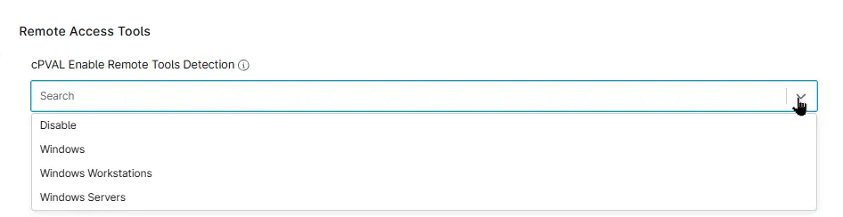

## Summary

Select the required platform to start detecting Unauthorized remote tools.

## Details

| Label | Field Name | Definition Scope | Type | Option Value | Default Value | Required  | Technician Permission | Automation Permission | API Permission | Description | Tool Tip | Footer Text | Custom Field Tab Name |
| ----- | ---------- | ---------------- | ---- | ------------ | ------------- | --------- | --------------------- | --------------------- | -------------- | ----------- | -------- | ----------- | ----------- |
|cPVAL Enable Remote Tools Detection|cpvalEnableRemoteToolsDetection|`Organization`, `Location`, `Device` | drop-down | `Windows`, `Windows Workstations`, `Windows Servers`, `Disable`, `Windows (with Ticketing)`, `Windows Workstations (with Ticketing)`,`Windows Servers (with Ticketing)`| - | False | Editable | Read/Write | Read/Write | Select the required OS to start detecting Unauthorized remote tools. | Select the required OS to start detecting Unauthorized remote tools. | Select the required OS to start detecting Unauthorized remote tools. |  Remote Access Tools |

## Dependencies

## Custom Field Creation

- [Custom Field Configuration](https://github.com/ProVal-Tech/ninjarmm/blob/main/custom-fields/cpval-enable-remote-tools-detection.toml)

## Sample Screenshot

## Changelog

### 2026-06-16

- Initial version of the document