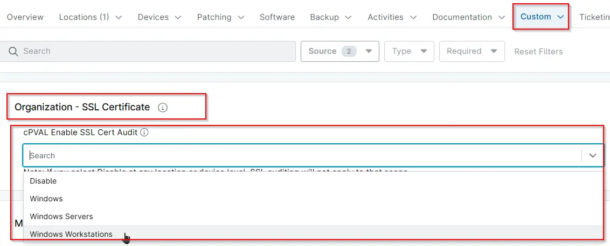

## Summary
Select the operating system for which SSL Certificate Audit should be enabled. Use this setting to specify the OS where audit will apply. | Choose the OS to enable SSL auditing. Select *Disable* at the location or device level to exclude it from auditing.

## Details

| Label | Field Name | Definition Scope | Type | Required | Default Value | Technician Permission | Automation Permission | API Permission | Description | Tool Tip | Footer Text |  Custom Field Tab Name |
| ----- | ---- | ---------------- | ---- | -------- | ------------- | --------------------- | --------------------- | -------------- | ----------- | -------- | ----------- | ----------- |
| cPVAL Enable SSL Cert Audit | cpvalEnableSslCertAudit | `Organizations`,`Devices`,`Location` | Drop-down | `true` | `Windows`, `Windows Servers`, `Windows Workstations`, `Disable` | Editable | Read_Write | Read_Write | Select the operating system for which SSL Certificate Audit should be enabled. Use this setting to specify the OS where audit will apply. | Choose the OS to enable SSL auditing. Select Disable at the location or device level to exclude it from auditing. | Note: If you select Disable at any location or device level, SSL auditing will not apply to that scope. | SSL Certificate |

## Dependencies
- [Solution - SSL Certificate Audit](/docs/cf5acc69-183c-4838-9484-2f3d9a247877)

## Custom Field Creation

- [Custom Field Configuration](https://github.com/ProVal-Tech/ninjarmm/blob/main/custom-fields/cpval-enable-ssl-cert-audit.toml)

## Sample Screenshot

## Changelog

### 2026-02-13

- Initial version of the document
