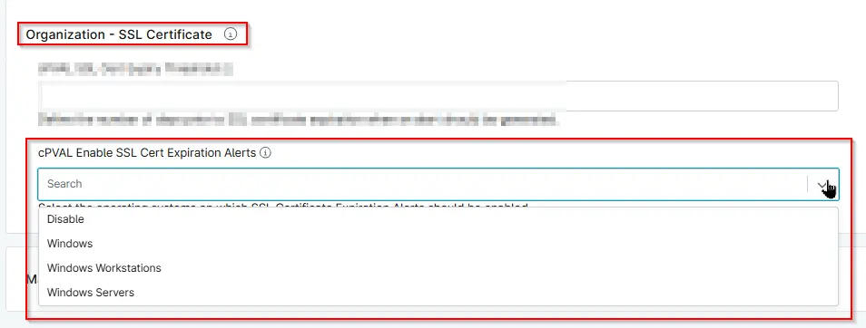

## Summary

Select the operating systems for which SSL Certificate Expiration Alerts should be enabled. It will detect expired and approaching expiration certificates based on configured threshold and generate alerts for the selected operating system.

## Details

| Label | Field Name | Definition Scope | Type | Required | Option Value | Default Value | Technician Permission | Automation Permission | API Permission |  Custom Field Tab Name |
| ----- | ---- | ---------------- | ---- | -------- | ------------ | ------------- | --------------------- | --------------------- | -------------- | ----------- |
| cPVAL Enable SSL Cert Expiration Alerts | cpvalEnableSslCertExpirationAlerts | Organization, Location, Device | DropDown | False  | Disable, Windows, Windows Workstations, Windows Servers |  | Editable | Read/Write | Read/Write | SSL Certificate |

## Dependencies

- [Solution - SSL Certificate Audit](/docs/cf5acc69-183c-4838-9484-2f3d9a247877)

## Custom Field Creation

- [Custom Field Configuration](https://github.com/ProVal-Tech/ninjarmm/blob/main/custom-fields/cpval-enable-ssl-cert-expiration-alert.toml)

## Sample Screenshot

## Changelog

### 2026-07-22

- Initial version of the document
