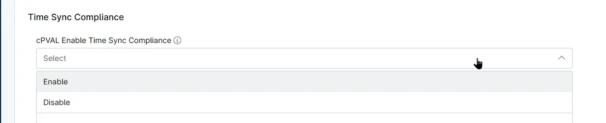

## Summary

Custom Field to enable device time synchronization with the NTP servers specified in the peer list.

## Details

| Label | Field Name | Definition Scope | Type | Required | Default Value | Options | Technician Permission | Automation Permission | API Permission |  Custom Field Tab Name |
| ----- | ---- | ---------------- | ---- | -------- | ------------- | ------------- | --------------------- | --------------------- | -------------- | ----------- |
| cPVAL Enable Time Sync Compliance | cpvalEnableTimeSyncCompliance | `Organization`, `Location`, `Device` | Drop-down | False | | <ul><li>Disable</li><li>Enable</li></ul> | Editable | Read_Write | Read_Write | Time Sync Compliance |

## Dependencies

- [Solution - Time Sync Compliance](/docs/49acbca5-5fa4-4f75-bbbc-595cec9a7e29)

## Custom Field Creation

- [Custom Field Configuration](https://github.com/ProVal-Tech/ninjarmm/blob/main/custom-fields/cpval-enable-time-sync-compliance.toml)

## Sample Screenshot

## Changelog

### 2026-10-02

- Initial version of the document