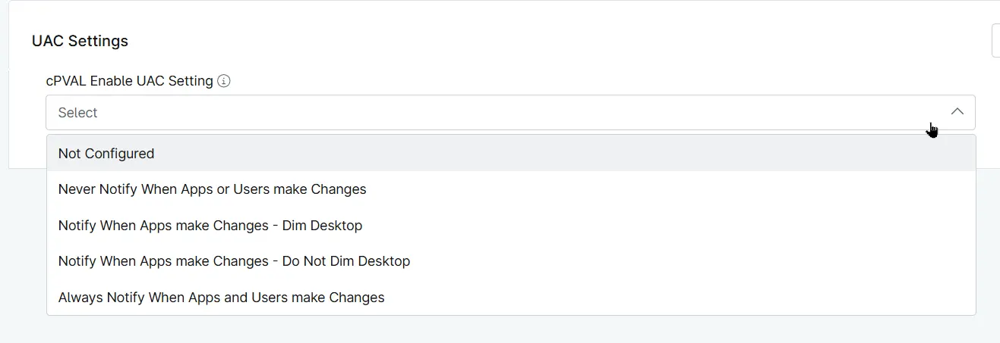

## Summary
Custom Field to choose the UAC setting to apply to Windows workstations.

## Details

| Label | Field Name | Example | Definition Scope | Type | Required | Default Value | Dropdown Options | Editable | Custom Field Tab |
| ----- | ---------- | ------- | ---------------- | ---- | -------- | ------------- | ---------------- | -------- | ---------------- |
| cPVAL Enable UAC Setting | cpvalEnableUacSetting | `Organization`, `Location`, `Device` | Drop-down | False | | <ul><li>Not Configured</li><li>Never Notify when apps or users make changes</li><li>Notify When Apps make Changes - Dim Desktop</li><li>Always Notify when Apps and Users make Changes</li><li>Notify When Apps make Changes - Do Not Dim Desktop</li></ul> | Editable | Read_Write | UAC Settings |

## Dependencies

- [Solution - Enable UAC Settings](/docs/01c2c7d9-7ce9-4e09-981b-b18e55ed2cbf)
- [Custom Field - cPVAL Enable UAC Setting](/docs/43bb3115-51f9-4523-9de9-1f948478f214) 

## Custom Field Creation

- [Custom Field Configuration](https://github.com/ProVal-Tech/ninjarmm/blob/main/custom-fields/cpval-enable-uac-setting.toml)

## Sample Screenshot

## Changelog

### 2026-10-08

- Initial version of the document