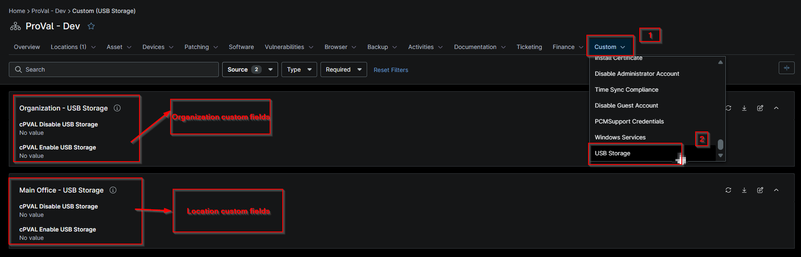

## Summary

## Details

| Label | Field Name | Example | Definition Scope | Type | Required | Default Value | Dropdown Options | Editable | Custom Field Tab |
| ----- | ---------- | ------- | ---------------- | ---- | -------- | ------------- | ---------------- | -------- | ---------------- |
| cPVAL Enable USB Storage | cpvalEnableUsbStorage | true or false | `Organization`, `Location`, `Device` | Checkbox | False |  |  | True | USB Storage |

## Dependencies

- [Solution - Set USB Storage State](/docs/8eb15892-347b-4786-a818-0d1bfb55f79b)

## Custom Field Creation

- [Custom Field Configuration](https://github.com/ProVal-Tech/ninjarmm/blob/main/custom-fields/cpval-enable-usb-storage.toml)

## Sample Screenshot

## Changelog

### 2026-10-02

- Initial version of the document