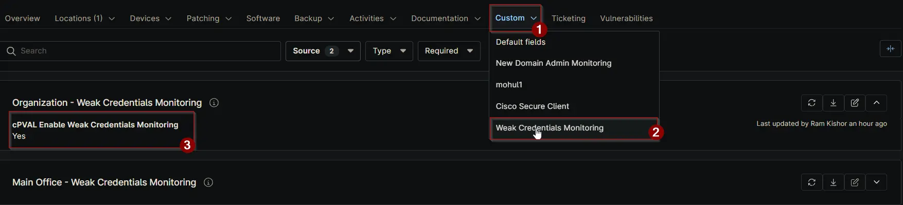

## Summary

Enable this checkbox to activate weak credential monitoring for the client's domain. The script will run against the client's primary domain controller.

## Details

| Label | Field Name | Definition Scope | Type | Required | Default Value | Technician Permission | Automation Permission | API Permission | Description | Tool Tip | Footer Text |  Custom Field Tab Name |
| ----- | ---- | ---------------- | ---- | -------- | ------------- | --------------------- | --------------------- | -------------- | ----------- | -------- | ----------- | ----------- |
| cPVAL Enable Weak Credentials Monitoring | cpvalEnableWeakCredentialsMonitoring | Organization | Checkbox | False | | Editable | Read_Write | Read_Write | Enable this checkbox to activate weak credential monitoring for the client's domain. The script will run against the client's primary domain controller. | Turn on weak credential monitoring for this domain. The script will execute on the primary domain controller. | This option runs a script on the client's primary domain controller to monitor weak credentials. | Weak Credentials Monitoring |

## Dependencies

- [Solution: Weak Credentials Monitoring](/docs/7d087aad-e93d-45d6-bc30-b31f8e78d6e6)

## Custom Field Creation

[Custom Field Configuration](https://github.com/ProVal-Tech/ninjarmm/blob/main/custom-fields/cpval-enable-weak-credentials-monitoring.toml)

## Sample Screenshot

