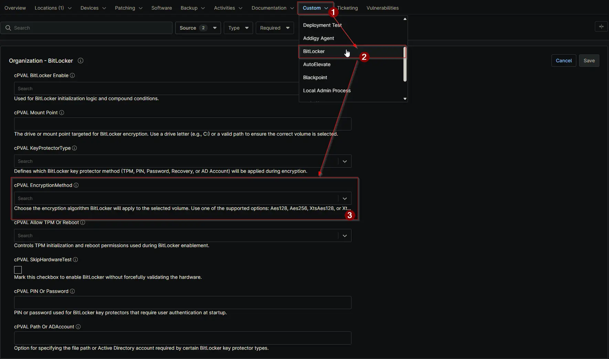

## Summary

The encryption method that will be used to protect the target volume. Valid options are: Aes128, Aes256, XtsAes128, XtsAes256

## Details

| Label | Field Name | Definition Scope | Type | Required | Available Options | Default Value | Technician Permission | Automation Permission | API Permission | Description | Tool Tip | Footer Text | Custom Field Tab Name |
| ----- | ---- | ---------------- | ---- | -------- | ------------- | ------------- | --------------------- | --------------------- | -------------- | ----------- | -------- | ----------- | ----------- |
| cPVAL EncryptionMethod | cpvalEncryptionmethod | `Organizations`,`Devices`,`Location` | Drop-down | `false` | `Aes128`, `Aes256`, `XtsAes128`, `XtsAes256` | `XtsAes128` | Editable | Read_Write | Read_Write | The encryption method that will be used to protect the target volume. Valid options are: Aes128, Aes256, XtsAes128, XtsAes256 | Specifies the BitLocker encryption algorithm to use. | Choose the encryption algorithm BitLocker will apply to the selected volume. Use one of the supported options. | BitLocker |

## Dependencies

- [Solution - BitLocker Initialize - NinjaOne](/docs/2ebfabd5-05cf-4175-a513-2aa290eb26e8)

## Custom Field Creation

[Custom Field Configuration](https://github.com/ProVal-Tech/ninjarmm/blob/main/custom-fields/cpval-encryption-method.toml)

## Sample Screenshot

