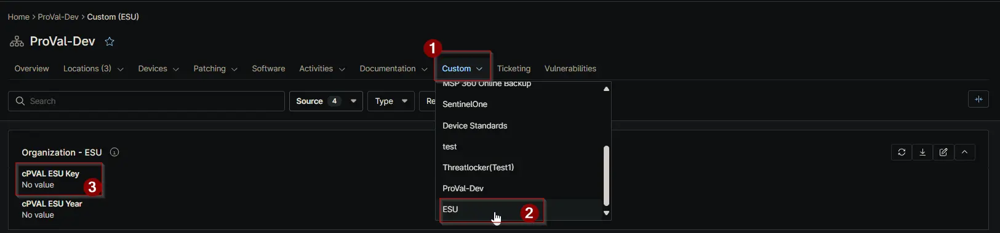

## Summary

Stores the ESU license key for activation of Windows 10 extended use. The license key stored in this Custom Field is used by the [Windows 10 ESU License Upgrade](/docs/ba4df182-e419-4377-819f-ef55c34b0380) task if the runtime variable `ESU Key` is not set.

## Details

| Label | Field Name | Definition Scope | Type | Required | Default Value | Technician Permission | Automation Permission | API Permission | Description | Tool Tip | Footer Text | Custom Field Tab Name |
| ----- | ---- | ---------------- | ---- | -------- | ------------- | --------------------- | --------------------- | -------------- | ----------- | -------- | ----------- | ----------- |
|cPVAL ESU Key| cpvalEsuKey| Device/Organization/Location | Text | No | |Editable | Read_Write | Read_Write | Provide the ESU license key for activation of Windows 10 extended use | Provide the ESU license key for activation of Windows 10 extended use | Provide the ESU license key for activation of Windows 10 extended use | ESU |

## Dependencies

- [Solution - Ninja Win10 ESU Licensing and Auditing](/docs/f1ae37d6-7fa7-414c-8550-1ae9ea11b987)

## Custom Field Creation

[Custom Field Configuration](https://github.com/ProVal-Tech/ninjarmm/blob/main/custom-fields/cpval-esu-key.toml)

## Sample Screenshot

