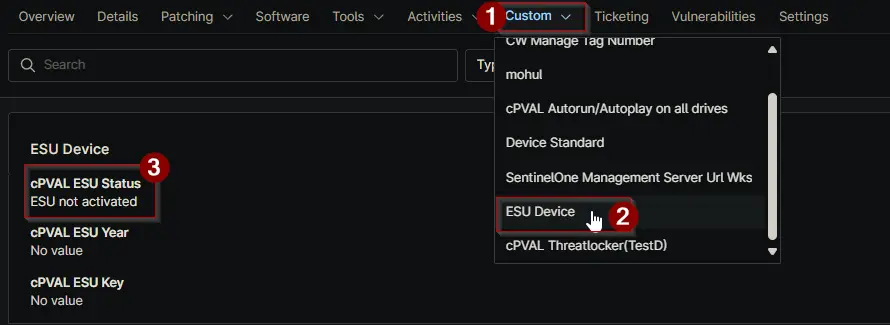

## Summary

This custom field stores the endpoint's ESU status fetched by the [ESU License Activation Detection](/docs/2110ef0d-ceaf-4b38-a4ff-647fe66e1015) script.

## Details

| Label | Field Name | Definition Scope | Type | Required | Default Value | Technician Permission | Automation Permission | API Permission | Description | Tool Tip | Footer Text |  Custom Field Tab Name |
| ----- | ---- | ---------------- | ---- | -------- | ------------- | --------------------- | --------------------- | -------------- | ----------- | -------- | ----------- | ----------- |
|cPVAL ESU Status | cpvalEsuStatus | Device | Text | No | | Read Only | Read_Write | Read_Write | This custom field stores the endpoint's ESU status | Windows 10 ESU Active License Status | Windows 10 ESU Active License Status | ESU Device |

## Dependencies

- [Automation - ESU License Activation Detection](/docs/2110ef0d-ceaf-4b38-a4ff-647fe66e1015)
- [Task - Windows 10 22H2 ESU Audit](/docs/d0241d14-c13f-4113-99ed-e267befd3103)
- [Solution - Ninja Win10 ESU Licensing and Auditing](/docs/f1ae37d6-7fa7-414c-8550-1ae9ea11b987)

## Custom Field Creation

[Custom Field Configuration](https://github.com/ProVal-Tech/ninjarmm/blob/main/custom-fields/cpval-esu-status.toml)

## Sample Screenshot

