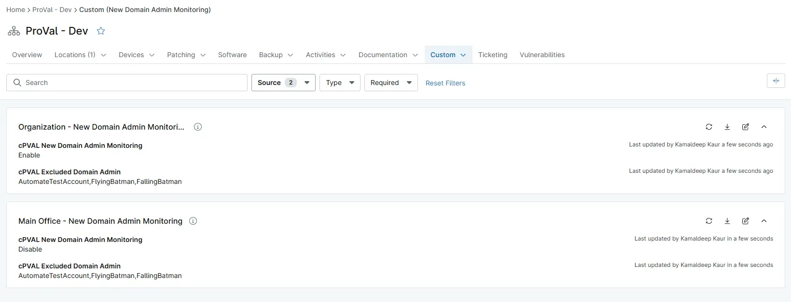

## Summary

Stores the usernames to exclude from generating the new domain admin detected tickets. Multiple usernames can be added by separating them with a comma like AutomateTestAccount,FlyingBatman,FallingBatman

## Details

| Label | Field Name | Definition Scope | Type | Required | Default Value | Technician Permission | Automation Permission | API Permission | Description | Tool Tip | Footer Text | Organization Level Custom Field Tab | Location Level Custom Field Tab | Device Level Custom Field Tab |
| ----- | ---- | ---------------- | ---- | -------- | ------------- | --------------------- | --------------------- | -------------- | ----------- | -------- | ----------- |----------- |----------- |----------- |
|cPVAL Excluded Domain Admin| cpvalExcludedDomainAdmin | Device,Organization,Location | Text | No | |Read Only | Read_Write | Read_Write | Add the usernames to exclude from generating the new domain admin detected tickets. Multiple usernames can be added by separating them with a comma like AutomateTestAccount,FlyingBatman,FallingBatman | Add the usernames to exclude from generating the new domain admin detected tickets. Multiple usernames can be added by separating them with a comma like AutomateTestAccount,FlyingBatman,FallingBatman | | New Domain Admin Monitoring | New Domain Admin Monitoring | New Domain Admin Monitoring Device  |

## Dependencies

- [Script : New Domain Admin Detected](/docs/a818ac38-9841-4049-9fda-1b87fa1bd19a)
- [Condition : New Domain Admin Detected](/docs/b300f17d-63ee-4c31-b29b-a9fb92a69a89)
- [Solution : New Domain Admin Detected](/docs/ffbbe3fe-f579-4521-a95a-1eb772d93ac7)

## Custom Field Creation

[Custom Field Configuration](https://github.com/ProVal-Tech/ninjarmm/blob/main/custom-fields/cpval-excluded-domain-admin.toml)

## Sample Screenshot

