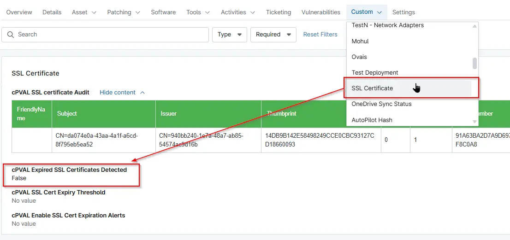

## Summary
This custom field is updated by the [Script : Windows - Certificates (My) - Local Machine - Audit](/docs/3c9e2ed2-f805-4da9-85fb-7fa1d1d146f5) to `True` when an expired certificate or a certificate approaching expiration date is detected on the device.

## Details

| Label | Field Name | Definition Scope | Type | Required | Default Value | Technician Permission | Automation Permission | API Permission | Description | Tool Tip | Footer Text | Custom Field Tab Name |
| ----- | ---- | ---------------- | ---- | -------- | ------------- | --------------------- | --------------------- | -------------- | ----------- | -------- | ----------- | ----------- |
|cPVAL Expired SSL Certificates Detected|cpvalExpiredSslCertificatesDetected| `Device` | Text |  False | | Editable | Read_Write | Read_Write | This custom field is updated by the `Windows - Certificates (My) - Local Machine - Audit` script to `True` when an expired certificate or a certificate approaching expiration date is detected on the device. | This custom field is updated by the `Windows - Certificates (My) - Local Machine - Audit` script to `True` when an expired certificate or a certificate approaching expiration date is detected on the device. | This custom field is updated by the `Windows - Certificates (My) - Local Machine - Audit` script to `True` when an expired certificate or a certificate approaching expiration date is detected on the device. | SSL Certificate |

## Dependencies

- [Solution - SSL Certificate Audit](/docs/cf5acc69-183c-4838-9484-2f3d9a247877)

## Custom Field Creation

- [Custom Field Configuration](https://github.com/ProVal-Tech/ninjarmm/blob/main/custom-fields/cpval-expired-ssl-certificates-detected.toml)

## Sample Screenshot

## Changelog

### 2026-07-20

- Initial version of the document

