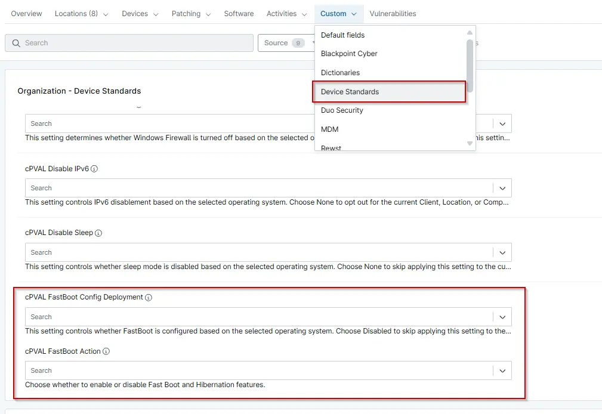

## Summary

This Custom Fields Controls the Configuration of Fastboot on the machine based on the selected operating system. Choose Disabled to skip applying this setting to the current Client, Location, or Computer.

## Details

| Label | Field Name | Definition Scope | Type | Required | Default Value | Available Options | Technician Permission | Automation Permission | API Permission | Description | Tool Tip | Footer Text | Custom Field Tab Name |
| ----- | ---- | ---------------- | ---- | -------- | ------------- | --------------------- | --------------------- | -------------- | ----------- | -------- | ----------- | ----------- | ----------- |
| cPVAL FastBoot Config Deployment | cpvalFastbootConfigDeployment | `Organization`, `Location`, `Device` | Drop-down | False | | `Disabled`, `Windows Workstations and Windows Server`, `Windows Workstations`, `Windows Servers` | Editable | Read_Write | Read_Write | Select the operating system(s) for which you want to deploy the solution. Choose Disabled to exclude the Client, Location, or Computer from this configuration. | Use this dropdown to specify the OS where FastBoot Should be configured. Selecting Disabled will retain the current settings for the selected entity. | This setting controls whether FastBoot is configured based on the selected operating system. Choose Disabled to skip applying this setting to the current Client, Location, or Computer. | Device Standards |

## Dependencies
- [Automation - Get Fast Boot and Hibernation Status](/docs/9dc318fa-ce35-47ae-9442-f867208cde93)
- [Automation - Enable or Disable Fast Boot [PVAL]](/docs/9aa78588-bc01-4aab-95bd-29b5640975a2)
- [Custom Field - cPVAL FastBoot Action](/docs/b9461be5-6fe8-4ce9-900f-4aa929fe2d78)
- [Compound Condition - FastBoot Config Windows Workstations](/docs/3ac6bda9-175b-4585-b252-b7456a440cdd)
- [Compound Condition - FastBoot Config Windows Server](/docs/95088908-fbea-4007-8914-f5b49d797dfe)
- [Solution - Enable or Disable FastBoot](/docs/0d0fda4d-0f91-4093-bb04-025117299d28)
- [Solution - Device Standards](/docs/a0c383d4-699a-4bb8-af7f-c2a007747182)

## Custom Field Creation

[Custom Field Configuration](https://github.com/ProVal-Tech/ninjarmm/blob/main/custom-fields/cpval-fastboot-config-deployment.toml)

## Sample Screenshot

