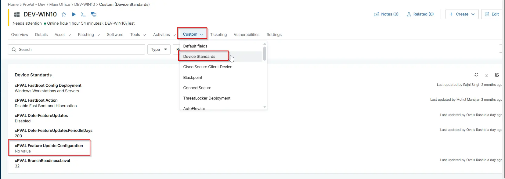

## Summary

This Custom Fields Controls the Configuration of Feature update deferral on the machine based on the selected operating system. Choose Disabled to skip applying this setting to the current Client, Location, or Computer.

## Details

| Label | Field Name | Definition Scope | Type | Required | Default Value | Technician Permission | Automation Permission | API Permission | Description | Tool Tip | Footer Text | Custom Field Tab Name |
| ----- | ---- | ---------------- | ---- | -------- | ------------- | --------------------- | --------------------- | -------------- | ----------- | -------- | ----------- | ----------- |
| cPVAL Feature Update Configuration | cpvalFeatureUpdateConfiguration | `Device`, `Location`, `Organization` | `DropDown` | false | `Disabled`, `Windows`, `Windows Servers`, `Windows Workstations` | Editable | Read/Write | Read/Write | This Custom Fields Controls the Configuration of Feature update deferral on the machine based on the selected operating system. Choose Disabled to skip applying this setting to the current Client, Location, or Computer. | Use this dropdown to specify the OS where Deferral setting Should be configured. Selecting Disabled will retain the current settings for the selected entity. | This setting controls whether Dererral update setting is configured based on the selected operating system. Choose Disabled to skip applying this setting to the current Client, Location, or Computer. | Device Standards |

## Dependencies

- [Solution - Device Standards](/docs/a0c383d4-699a-4bb8-af7f-c2a007747182)
- [Solution: Update Windows Deferral Settings](/docs/56e6b247-f80a-4bd8-b2e2-8cf44f76b7e1)
- [Automation: update windows deferral settings](/docs/5d4e1aa7-4ec8-4a7a-ba50-7a93366a232a)
- [Compound Conditions: Feature Update Defer Configuration workstations](/docs/73c10fcb-2102-4e7d-80b6-e051cf8e55ec)
- [Compound Conditions: Feature Update Defer Configuration servers](/docs/00483199-7fbc-4838-82e7-32cfa2c626cf)

## Custom Field Creation

- [Custom Field Configuration](https://github.com/ProVal-Tech/ninjarmm/blob/main/custom-fields/cpval-feature-update-configuration.toml)

## Sample Screenshot

## Changelog

### 2026-03-06

- Initial version of the document
