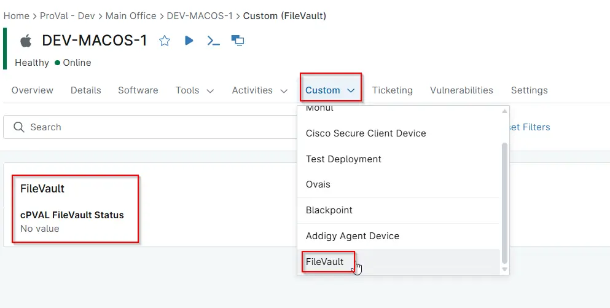

## Summary

This custom field is used to store the FileVault status on macOS devices by updating the NinjaRMM custom field `cPVAL FileVault Status` to indicate whether FileVault is enabled or not.

Note: `This is only compatible for Mac OS devices.`

## Details

| Label     | Field Name      | Definition Scope | Type | Required | Default Value | Technician Permission | Automation Permission | API Permission | Description  | Tool Tip | Footer Text | Custom Field Tab Name |
| ----------------------------------- | -------------------------------- | ---------------- | ---- | -------- | ------------- | --------------------- | --------------------- | -------------- | ----------------------------------------------------------------------------------------------------------------------------------------------------------------------------------------------- | -------- | ----------- | --------------------- |
| cPVAL FileVault Status | cpvalFilevaultStatus | `Organization`, `Location`, `Device`     | Text | Yes      | -             | Editable       | Read/Write            | Read/Write     | This custom field is used to store the FileVault status on macOS devices by updating the NinjaRMM custom field `cPVAL FileVault Status` to indicate whether FileVault is enabled or not. | This shows fileVault status.   | This shows fileVault status.  | `FileVault` |

## Dependencies

- [Automation - Check FileVault Status](/docs/14fdee94-c1d6-4519-850e-89b4ae34b411)

## Custom Field Creation

- [Custom Field Configuration](https://github.com/ProVal-Tech/ninjarmm/blob/main/custom-fields/cpval-filevault-status.toml)

## Sample screenshot

