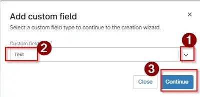
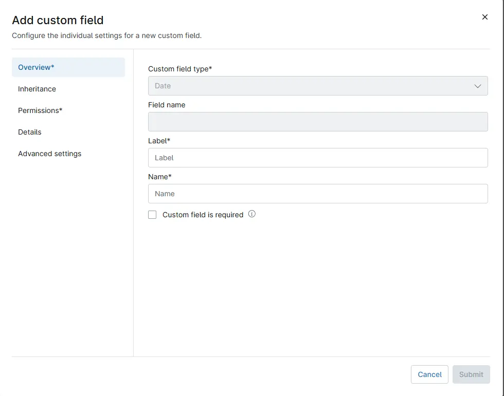
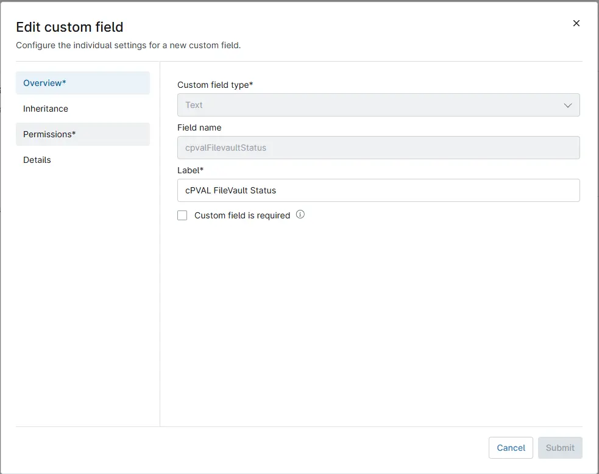
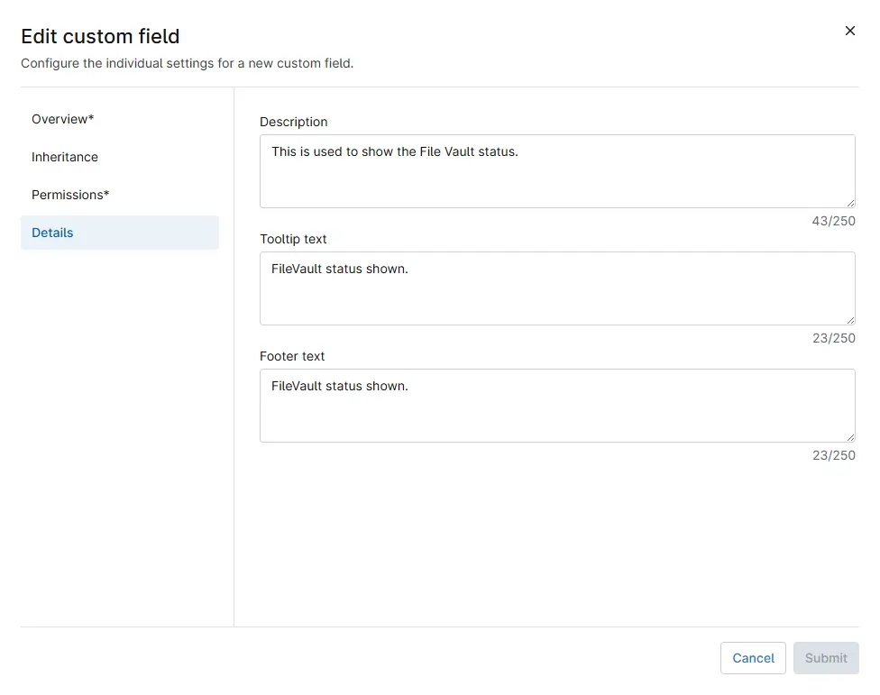
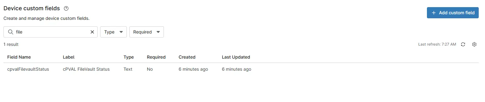

## Summary

This custom field is used to update the status of File Vault.

## Details

| Label                               | Field Name                       | Definition Scope | Type | Required | Default Value | Technician Permission | Automation Permission | API Permission | Description                                                                                                                                                                                     | Tool Tip | Footer Text | Custom Field Tab Name |
| ----------------------------------- | -------------------------------- | ---------------- | ---- | -------- | ------------- | --------------------- | --------------------- | -------------- | ----------------------------------------------------------------------------------------------------------------------------------------------------------------------------------------------- | -------- | ----------- | --------------------- |
| cPVAL FileVault Status | cpvalFilevaultStatus | `Organization`, `Location`, `Device`     | Text | Yes      | -             | Editable              | Read/Write            | Read/Write     | This is used to show the File Vault status. | FileVault status shown.       | FileVault status shown.          | `File Vault` , `FileVault`     |

## Dependencies

- [FileVault Status](/docs/da444ba9-ae51-48f8-8913-35f206579b04)

## Custom Field Creation

- [Custom Field Configuration](https://github.com/ProVal-Tech/ninjarmm/blob/main/custom-fields/xpval-filevault-status.toml)

## Sample screenshot

### Step 1

Navigate to the `Administration` menu, then proceed to `Devices` and select `Devices Custom Fileds` and Locate the `Add Custom Filed` button on the right-hand side of the screen and click on it. After clicking the `Add Custom Filed` button, select the `Field` button that appears.

### Step 2

After clicking the `Filed` button, The following Pop-up screen will appear.

From the drop down select the `Text` custom field type

After selecting the custom filed type, click continue and The following Pop-up screen will appear.

After that fill the custom filed name and click Next

After fill the custom filed name, click next and The following Pop-up screen will appear.

Fill in the following information in the `Inheritance` section and click the `Next` button.

After fill the Inheritance, click next and The following Pop-up screen will appear.

Fill in the following information in the `permissions` section and click the `Next` button.

After fill the Inheritance, click next and The following Pop-up screen will appear.

Fill in the following information in the `Details` section and click the `Next` button.

- **Description:** `This is used to show the File Vault status.`  
- **Tooltip Text:** `FileVault status shown.`  
- **Footer Text:** `FileVault status shown.`

Once created it will look like this:

