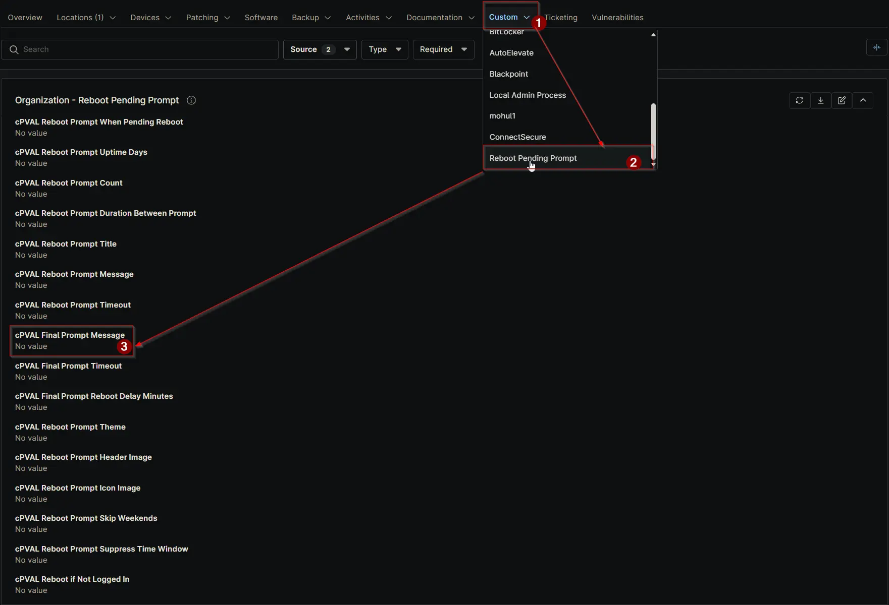

## Summary

This field contains the final message displayed to the logged-in user before the system initiates a reboot. The reboot will occur after the delay specified in the “cPVAL Final Prompt Reboot Delay Minutes” custom field. Keep it short; “This is the final prompt before your computer will automatically restart. Your computer will be restarted after `{X}` minute(s) after you acknowledge this prompt.” will be added automatically.

## Details

| Label | Field Name | Definition Scope | Type | Required | Default Value | Dropdown Options | Technician Permission | Automation Permission | API Permission | Description | Tool Tip | Footer Text | Org Level Tab | Location Level Tab | Device Level Tab |
| ----- | ---- | ---------------- | ---- | -------- | ------------- | ---------------- | --------------------- | --------------------- | -------------- | ----------- | -------- | ----------- | ----------- | ----------- | ----------- |
| cPVAL Final Prompt Message | cpvalFinalPromptMessage | Organization, Location, Device | Text | False | | | Editable | Read_Write | Read_Write | This field contains the final message displayed to the logged-in user before the system initiates a reboot. The reboot will occur after the delay specified in the “cPVAL Final Prompt Reboot Delay Minutes” custom field. Keep it short; “This is the final prompt before your computer will automatically restart. Your computer will be restarted after `{X}` minute(s) after you acknowledge this prompt.” will be added automatically. | Enter the message that will appear in the last prompt shown to the user before the computer restarts. Make sure the message clearly informs the user about the reboot and any necessary actions they should take. | After this prompt is acknowledged, the system will automatically reboot in the number of minutes defined in “cPVAL Final Prompt Reboot Delay Minutes.” Ensure the message provides sufficient notice for the user to save their work. | Reboot Pending Prompt | Reboot Pending Prompt | Reboot Pending Prompt - Workstations |

## Dependencies

- [Solution: Reboot Pending Prompt](/docs/d7758fa4-9fcc-4259-a7a5-0ca65dda10eb)

## Custom Field Creation

- [Custom Field Configuration](https://github.com/ProVal-Tech/ninjarmm/blob/main/custom-fields/cpval-final-prompt-message.toml)

## Sample Screenshot

