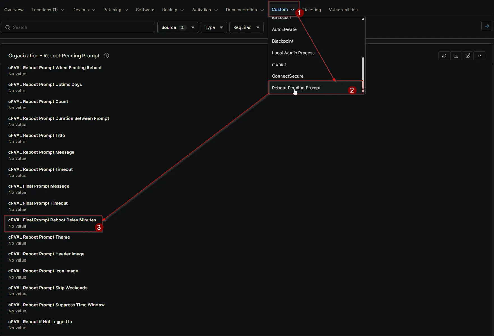

## Summary

Specifies how many minutes to delay the forced reboot after the final prompt. Default applies if not set. Can be configured or overridden at Client, Location, or Device level.

## Details

| Label | Field Name | Definition Scope | Type | Required | Default Value |  Technician Permission | Automation Permission | API Permission | Description | Tool Tip | Footer Text | Org Level Tab | Location Level Tab | Device Level Tab |
| ----- | ---- | ---------------- |  -------- | ------------- | ---------------- | --------------------- | --------------------- | -------------- | ----------- | -------- | ----------- | ----------- | ----------- | ----------- |
| cPVAL Final Prompt Reboot Delay Minutes | cpvalFinalPromptRebootDelayMinutes | Organization, Location, Device | Integer | False |  | Editable | Read_Write | Read_Write | Specifies how many minutes to delay the forced reboot after the final prompt. Default applies if not set. Can be configured or overridden at Client, Location, or Device level. | Enter delay in minutes before enforcing reboot after the last prompt. Can be overridden at Location or Device level. | Controls the grace period after the final prompt before reboot occurs. Overrides at Location or Device level allow flexibility. | Reboot Pending Prompt | Reboot Pending Prompt | Reboot Pending Prompt - Workstations |

## Dependencies

- [Solution: Reboot Pending Prompt](/docs/d7758fa4-9fcc-4259-a7a5-0ca65dda10eb)

## Custom Field Creation

- [Custom Field Configuration](https://github.com/ProVal-Tech/ninjarmm/blob/main/custom-fields/cpval-final-prompt-reboot-delay-minutes.toml)

## Sample Screenshot

