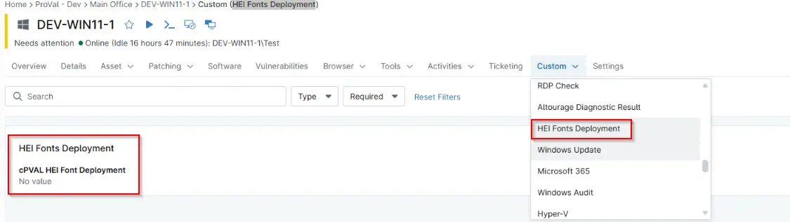

## Summary

Controls deployment logic during automation and compound condition evaluation.

## Details

| Label | Field Name | Definition Scope | Type | Required | Default Value | Technician Permission | Automation Permission | API Permission | Description | Tool Tip | Footer Text |  Custom Field Tab Name |
| ----- | ---- | ---------------- | ---- | -------- | ------------- | --------------------- | --------------------- | -------------- | ----------- | -------- | ----------- | ----------- |
| cPVAL HEI Font Deployment | cpvalHeiFontDeployment | `Device`, `organization`, `Location` | `Drop-Down`| True | `Disabled`, `Windows Workstations` | Editable | `Read/Write` | `Read/Write` | Select the operating system(s) on which HEI fonts should be configured.both Windows and Macintosh computers.   | Auto deployment can be enabled for Windows machines only or for both Windows and Macintosh computers. | HEI Fonts Deployment |

## Dependencies

- [Compound Condition - Install Hei Fonts - Windows Workstations](/docs/85a2de03-5004-4e90-9598-9de731bb5b6b)
- [Solution - Install Hei Fonts](/docs/f81e8a64-f17b-4f0f-ba46-be61933e0582)

## Custom Field Creation

- [Custom Field Configuration](https://github.com/ProVal-Tech/ninjarmm/blob/main/custom-fields/cpval-hei-font-deployment.toml)

## Sample Screenshot

## Changelog

### 2026-25-09

- Initial version of the document
