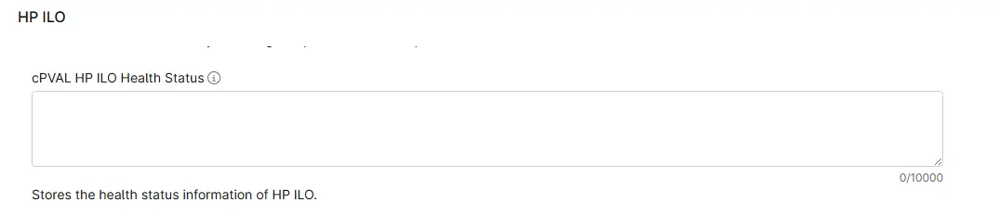

## Summary
Stores the health status information of HP ILO. 

## Details

| Label | Field Name | Definition Scope | Type | Required | Default Value | Technician Permission | Automation Permission | API Permission | Description | Tool Tip | Footer Text |  Custom Field Tab Name |
| ----- | ---- | ---------------- | ---- | -------- | ------------- | --------------------- | --------------------- | -------------- | ----------- | -------- | ----------- | ----------- |
| cPVAL HP iLO Health Status | cpvalhpollohealthstatus | Device | Multi Line | False |  | Editable | Read_Write | Read_Write | Stores the health status information of HP iLO. This Custom Field is updated by `HP iLO Health Check` automation. | Stores the health status information of HP iLO. | Stores the health status information of HP iLO. | HP iLO|

## Dependencies

- [Solution - HP iLO Health Check](/docs/593be8f7-970f-4b6a-80b0-7cf0ff3396a6) 

## Custom Field Creation

- [Custom Field Configuration](https://github.com/ProVal-Tech/ninjarmm/blob/main/custom-fields/cpval-hp-iLO-health-status.toml)

## Sample Screenshot

## Changelog

### 2026-04-09

- Initial version of the document
