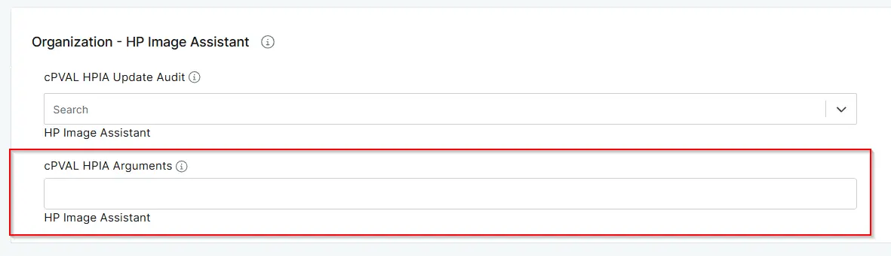

## Summary

HPIA arguments to execute. See the [HP Image Assistant User Guide ](https://ftp.hp.com/pub/caps-softpaq/cmit/imagepal/userguide/936944-005.pdf) for supported parameters.

## Details

| Label | Field Name | Definition Scope | Type | Required | Default Value | Technician Permission | Automation Permission | API Permission | Description | Tool Tip | Footer Text |  Custom Field Tab Name |
| ----- | ---- | ---------------- | ---- | -------- | ------------- | --------------------- | --------------------- | -------------- | ----------- | -------- | ----------- | ----------- |
| cPVAL HPIA Arguments | cpvalHpiaArguments | Organization/Location/Computer | Text | False | - | Editable | Read/Write | Read/Write | HP Image Assistant Command arguments to execute on the computer; a scan to list available updates will be executed if this parameter is left blank. Reference: https://ftp.hp.com/pub/caps-softpaq/cmit/imagepal/userguide/936944-005.pdf | HP Image Assistant Command arguments to execute on the computer; a scan to list available updates will be executed if this parameter is left blank. Reference: https://ftp.hp.com/pub/caps-softpaq/cmit/imagepal/userguide/936944-005.pdf | HP Image Assistant | HP Image Assistant | 

## Dependencies

- [Solution - HP Image Assistant](/docs/4c4053fb-301c-4c77-8e7f-97ed2f00b391)

## Custom Field Creation

- [Custom Field Configuration](https://github.com/ProVal-Tech/ninjarmm/blob/main/custom-fields/cpval-hpia-arguments.toml)

## Sample Screenshot

## Changelog

### 2026-06-03

- Initial version of the document
