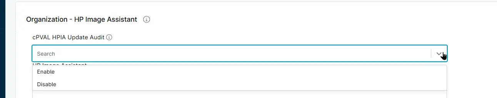

## Summary
Custom Field to enable automatic deployment of the HP Image Assistant scanning on HP Windows machines.

## Details

| Label | Field Name | Definition Scope | Type |Option Value | Required | Default Value | Technician Permission | Automation Permission | API Permission | Description | Tool Tip | Footer Text |  Custom Field Tab Name |
| ----- | ---- | ---------------- | ---- | -------- | ------------- | --------------------- | -------------- | ----------- | -------- | ----------- | ----------- | ----- | ---- |
|cPVAL HPIA Update Audit|cpvalHpiaUpdateAudit|Organization/Location/Computer|Drop-Down| `Enable`, `Disable` | True | - | Editable | Read/Write | Read/Write | Custom Field is required to be selected for the automated deployment of the HP Image Assistant scanning on the HP Windows machines. | Custom Field is required to be selected for the automated deployment of the HP Image Assistant scanning on the HP Windows machines.| HP Image Assistant | HP Image Assistant |

## Dependencies

- [Solution - HP Image Assistant](/docs/4c4053fb-301c-4c77-8e7f-97ed2f00b391)

## Custom Field Creation

- [Custom Field Configuration](https://github.com/ProVal-Tech/ninjarmm/blob/main/custom-fields/cpval-hpia-update-audit.toml)

## Sample Screenshot

## Changelog

### 2026-06-03

- Initial version of the document
