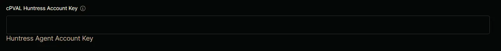

## Summary

This is the Account Key that determines which Huntress Account an Agent should be associated with.

## Details

| Label | Field Name | Definition Scope | Type | Required  | Technician Permission | Automation Permission | API Permission | Description | Tool Tip | Footer Text | Custom Field Tab Name |
| ----- | ---------- | ---------------- | ---- | --------- | --------------------- | --------------------- | -------------- | ----------- | -------- | ----------- | -- |
| cPVAL Huntress Account Key | cpvalHuntressAccountKey | Organization | Text | False | Editable | Read/Write | Read/Write | This is the Account Key that determines which Huntress Account an Agent should be associated with. | Paste your account secret key (from your Huntress portal's "download agent" section) | Huntress Agent Account Key | Huntress | 

## Dependencies

- [Solution : Huntress Agent Deployment](/docs/e0ad73d2-fcab-43f0-9866-72a48623ef48)

## Custom Field Creation

- [Custom Field Configuration](https://github.com/ProVal-Tech/ninjarmm/blob/main/custom-fields/cpval-huntress-account-key.toml)

## Sample Screenshot

## Changelog

## 2026-05-27

- Updated the documents as per our new template.

### 2025-04-11

- Initial version of the document
