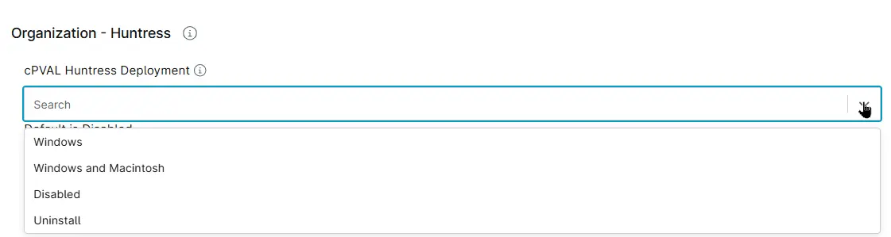

## Summary

Choose the operating system to activate the auto deployment of the Huntress Agent. Auto deployment can be enabled for Windows machines only or for both Windows and Macintosh computers. Select Uninstall for Uninstallation.

## Details

| Label | Field Name | Definition Scope | Type | Option Value | Default Value | Required  | Technician Permission | Automation Permission | API Permission | Description | Tool Tip | Footer Text | Custom Field Tab Name |
| ----- | ---------- | ---------------- | ---- | ------------ | ------------- | --------- | --------------------- | --------------------- | -------------- | ----------- | -------- | ----------- | ---------- |
| cPVAL Huntress Deployment | cpvalHuntressDeployment | Organization/Location/Computer | drop-down | `Windows`, `Windows and Macintosh`, `Disabled`,`Uninstall` | `Disabled` | False | Editable | Read/Write | Read/Write |Choose the operating system to activate the auto deployment of the Huntress Agent. Auto deployment can be enabled for Windows machines only or for both Windows and Macintosh computers. Select Uninstall for Uninstallation. | Choose the Operating System to enable the Auto Deployment of the Huntress Agent. Uninstall for Uninstallation. | Default is Disabled | Huntress |

## Dependencies

- [Solution : Huntress Agent Deployment](/docs/e0ad73d2-fcab-43f0-9866-72a48623ef48)

## Custom Field Creation

- [Custom Field Configuration](https://github.com/ProVal-Tech/ninjarmm/blob/main/custom-fields/cpval-huntress-deployment.toml)

## Sample Screenshot

## Changelog

### 2026-06-02

- Added Uninstall option to the custom field and changed its scope to location and devices. Location and devices can be excluded from the solution, using this custom field only.
- Updated the document as per our new template.

### 2025-04-11

- Initial version of the document
