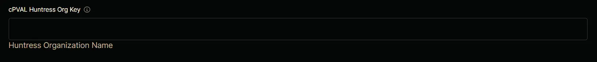

## Summary

By default, the Huntress Organization key is the name of the Organization. Set this custom field if it''s different for the Organization.

## Details

| Label | Field Name | Definition Scope | Type | Required  | Technician Permission | Automation Permission | API Permission | Description | Tool Tip | Footer Text | Custom Field Tab Name |
| ----- | ---------- | ---------------- | ---- | --------- | --------------------- | --------------------- | -------------- | ----------- | -------- | ----------- | ---- |
| cPVAL Huntress Org Key | cpvalHuntressOrgKey | Organization | Text | False | Editable | Read/Write | Read/Write | By default, the Huntress Organization key is the name of the Organization. Set this custom field if it's different for the Organization. | Leave it blank if the Organization name is the same in both Ninja and Huntress portals. | Huntress Organization Name | Huntress | 

## Dependencies

- [Solution : Huntress Agent Deployment](/docs/e0ad73d2-fcab-43f0-9866-72a48623ef48)

## Custom Field Creation

- [Custom Field Configuration](https://github.com/ProVal-Tech/ninjarmm/blob/main/custom-fields/cpval-huntress-org-key.toml)

## Sample Screenshot

## Changelog

### 2026-06-02

- Updated the documents as per our new template.

### 2025-04-11

- Initial version of the document
