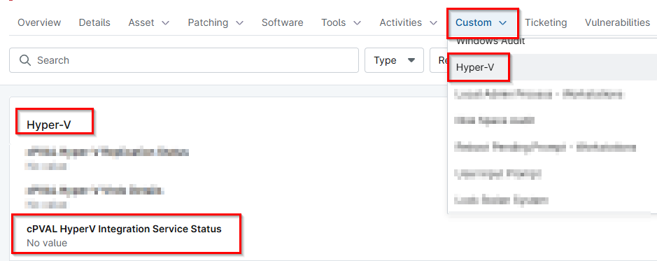

## Summary

This custom field stores the Hyper-V integration service status fetched by the [Script - Hyper-V Integration Service Audit](/docs/1c8cf2c3-d470-4616-bc27-35e69f274202).

## Details

| Label | Field Name | Definition Scope | Type | Required | Default Value | Technician Permission | Automation Permission | API Permission | Description | Tool Tip | Footer Text |  Custom Field Tab Name |
| ----- | ---- | ---------------- | ---- | -------- | ------------- | --------------------- | --------------------- | -------------- | ----------- | -------- | ----------- | ----------- |
| cPVAL Hyper-V Integration Service Status | cpvalHypervIntegrationServiceStatus | `Device` | Multi-line | False |  | Read Only | Read/Write | Read/Write | This custom field stores the Hyper-V integration service status fetched by the [Script - Hyper-V Integration Service Audit](/docs/1c8cf2c3-d470-4616-bc27-35e69f274202). |  |  | Hyper-V |

## Dependencies

- [Script - Hyper-V Integration Service Audit](/docs/1c8cf2c3-d470-4616-bc27-35e69f274202)
- [Solution - Hyper-V Replication Integration Alert](/docs/4deaf362-a762-4a05-9118-326edc7ff523)

## Custom Field Creation

- [Custom Field Configuration](https://github.com/ProVal-Tech/ninjarmm/blob/main/custom-fields/cpval-hyperv-integration-service-status.toml)

## Sample Screenshot

## Changelog

### 2026-05-11

- Initial version of the document