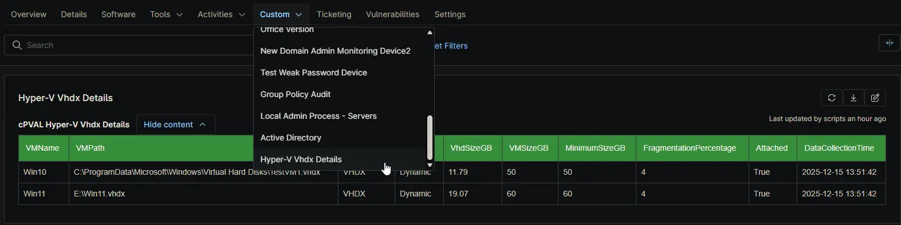

## Summary

Stores an HTML-formatted inventory of Hyper-V Virtual Hard Disks (VHD/VHDX). Data is populated via the [Audit Hyper-V VHDX](/docs/73c2e2db-d5ee-4d7f-80eb-6593abe5abbf) automation script and includes disk paths, allocation types (Dynamic/Fixed), current file size, and fragmentation percentage.

## Details

| Label | Field Name | Definition Scope | Type | Required | Default Value | Technician Permission | Automation Permission | API Permission | Description | Tool Tip | Footer Text |  Custom Field Tab Name |
| ----- | ---- | ---------------- | ---- | -------- | ------------- | --------------------- | --------------------- | -------------- | ----------- | -------- | ----------- | ----------- |
| cPVAL Hyper-V Vhdx Details | cpvalHypervVhdxDetails | Device (Windows Server)| WYSIWYG | True | | Editable | Read_Write | Read_Write | Stores an HTML-formatted inventory of Hyper-V Virtual Hard Disks (VHD/VHDX). Data is populated via the "Audit Hyper-V VHDX" automation script and includes disk paths, allocation types (Dynamic/Fixed), current file size, and fragmentation percentage. | Displays detailed storage metrics for all VHD/VHDX files attached to Hyper-V VMs on this device. | Auto-generated by script. Do not edit manually. Check the table 'DataCollectionTime' column for age of data. | Hyper-V Vhdx Details |

## Dependencies

- [Script: Audit Hyper-V VHDX](/docs/73c2e2db-d5ee-4d7f-80eb-6593abe5abbf)
- [Solution: Hyper-V VHDX Auditing](/docs/ac904ba5-b501-4137-9f09-9960c88f4aa4)

## Custom Field Creation

[Custom Field Configuration](https://github.com/ProVal-Tech/ninjarmm/blob/main/custom-fields/cpval-hyperv-vhdx-details.toml)

## Sample Screenshot

