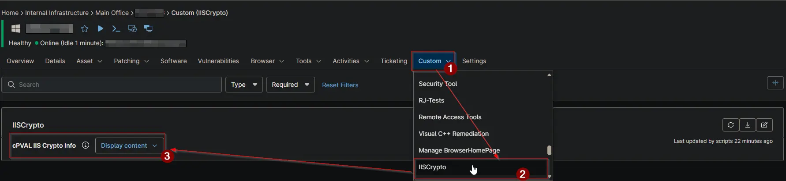
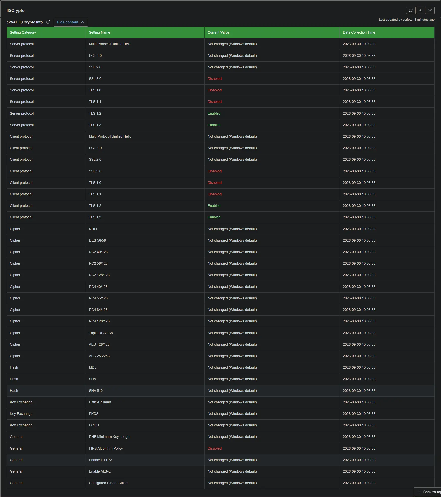

## Summary

Stores an HTML table of Windows TLS and cipher suite settings captured by the IIS Crypto audit. Each row shows the setting category, setting name, current value, and data collection time. Populated automatically whenever the [Audit and Apply IIS Crypto Security Templates](/docs/8f3d21a7-c4e9-4b6a-9d2f-7e5c1a8b3f6d) script runs with Audit enabled.

## Details

| Label | Field Name | Example | Definition Scope | Type | Required | Default Value | Dropdown Options | Editable | Custom Field Tab |
| ----- | ---------- | ------- | ---------------- | ---- | -------- | ------------- | ---------------- | -------- | ---------------- |
| cPVAL IIS Crypto Info | cpvalIisCryptoInfo | `<table><tr><td>Server protocol</td><td>TLS 1.2</td><td>Enabled</td><td>2026-09-29 14:32:07</td></tr></table>` | `Devices` | WYSIWYG | `False` | `null` | | `False` | IISCrypto |

## Field Texts

| Text | Value |
| ---- | ----- |
| Description | Stores the latest IIS Crypto audit results as a formatted table of Windows TLS and cipher suite settings. Populated automatically by the [Audit and Apply IIS Crypto Security Templates](/docs/8f3d21a7-c4e9-4b6a-9d2f-7e5c1a8b3f6d) script whenever it runs with Audit enabled. |
| Help Text | Windows TLS and cipher suite settings captured by the most recent IIS Crypto audit. Each row shows the setting category, setting name, current value, and the data collection time. A value of Not changed (Windows default) means the setting has never been modified and Windows is still using its default. Enabled and Disabled values indicate settings explicitly configured by an applied template. |
| Footer Text | Data reflects the most recent audit run on this device. To refresh it, run the [Audit and Apply IIS Crypto Security Templates](/docs/8f3d21a7-c4e9-4b6a-9d2f-7e5c1a8b3f6d) script with Audit enabled. Recently applied templates may require a reboot before all values take effect. |

## Dependencies

- [Automation: [Audit and Apply IIS Crypto Security Templates](/docs/8f3d21a7-c4e9-4b6a-9d2f-7e5c1a8b3f6d) [Windows]](/docs/8f3d21a7-c4e9-4b6a-9d2f-7e5c1a8b3f6d)

## cPVAL IIS Crypto Info

| Column Name | Description |
| :--- | :--- |
| Setting Category | The group the setting belongs to: `Server protocol`, `Client protocol`, `Cipher`, `Hash`, `Key Exchange`, or `General`. |
| Setting Name | The audited protocol, cipher, hash algorithm, or key exchange mechanism (e.g., `TLS 1.2`, `AES 128/128`, `SHA 256`, `FIPS Algorithm Policy`). |
| Current Value | The configured state: `Enabled`, `Disabled`, or `Not changed (Windows default)`. `Not changed (Windows default)` means the setting has never been modified and Windows is still using its default. |
| Data Collection Time | The date and time the audit was performed. |

## Custom Field Creation

[Custom Field Configuration](https://github.com/ProVal-Tech/ninjarmm/blob/main/custom-fields/cpval-iis-crypto-info.toml)

## Sample Screenshot

  

## Changelog

### 2026-09-29

- Initial version of the document
