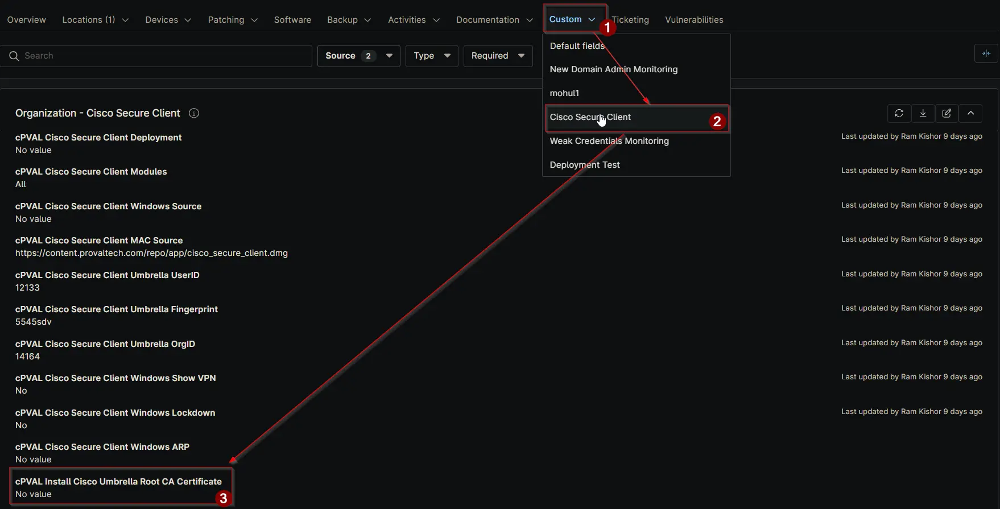

## Summary

Flag this checkbox to enable installation of the Cisco Umbrella Root CA certificate on all Windows and Mac devices managed for the client. This ensures secure SSL inspection and trusted communication with Cisco Umbrella services.

## Details

| Label | Field Name | Definition Scope | Type | Required | Default Value | Technician Permission | Automation Permission | API Permission | Description | Tool Tip | Footer Text |  Custom Field Tab Name |
| ----- | ---- | ---------------- | ---- | -------- | ------------- | --------------------- | --------------------- | -------------- | ----------- | -------- | ----------- | ----------- |
| cPVAL Install Cisco Umbrella Root CA Certificate | cpvalInstallCiscoUmbrellaRootCaCertificate | Organization | Checkbox | False | | Editable | Read_Write | Read_Write | Flag this checkbox to enable installation of the Cisco Umbrella Root CA certificate on all Windows and Mac devices managed for the client. This ensures secure SSL inspection and trusted communication with Cisco Umbrella services. | Select this checkbox to deploy the Cisco Umbrella Root CA certificate across all machines (Windows and Mac) for enhanced security and SSL decryption. | Enabling it will install the Cisco Umbrella Root CA certificate on all supported devices. Confirm with client security policies before proceeding. | Cisco Secure Client |

## Dependencies

- [Solution: Cisco Umbrella Root CA Certificate Installation](/docs/e1e5a6ab-f810-4e94-8b67-d32b626ab049)

## Custom Field Creation

[Custom Field Configuration](https://github.com/ProVal-Tech/ninjarmm/blob/main/custom-fields/cpval-install-cisco-umbrella-root-ca-certificate.toml)

## Sample Screenshot

