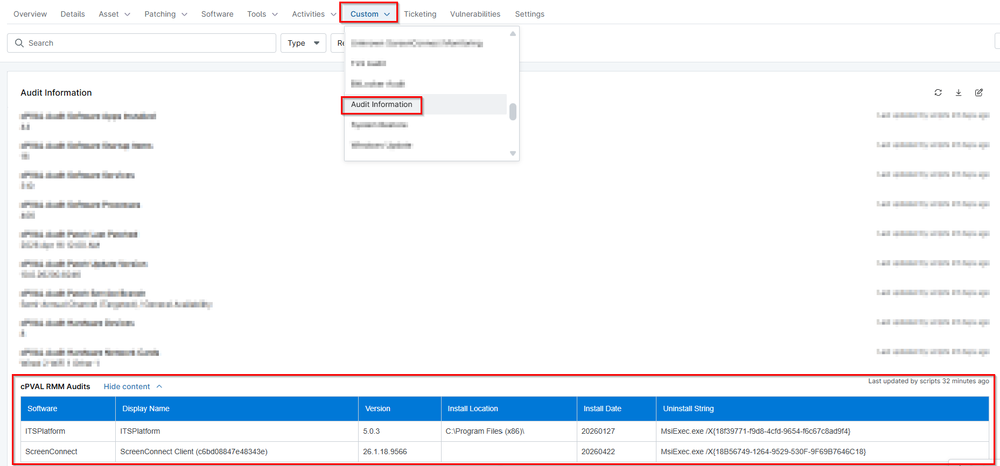

## Summary

This custom field stores the remote management applications list gathered by the script [Installed Remote Tools Audit](/docs/8111fecc-61de-4c72-933c-b719351b7a1e).

## Details

| Label | Field Name | Definition Scope | Type | Required | Default Value | Technician Permission | Automation Permission | API Permission | Custom Field Tab Name |
| ----- | ---- | ---------------- | ---- | -------- | ------------- | --------------------- | --------------------- | -------------- | ----------- | 
| cPVAL Installed Remote Access Tools | cpvalInstalledRemoteAccessTools | `Device` | WYSIWYG | False |  | Read Only | Read/Write | Read/Write |  Remote Access Tools |

## Dependencies

- [Solution - Installed Remote Access Tool Audit](/docs/eae2fab9-4697-4e1e-ad8f-93f8a09d7056)
- [Script - Installed Remote Tools Audit](/docs/8111fecc-61de-4c72-933c-b719351b7a1e)

## Custom Field Creation

- [Custom Field Configuration](https://github.com/ProVal-Tech/ninjarmm/blob/main/custom-fields/cpval-installed-remote-access-tools.toml)

## Sample Screenshot

## Changelog

### 2026-06-24

- Renamed the custom field to `cPVAL Installed Remote Access Tools` from `cPVAL RMM Audits`

### 2026-05-21

- Initial version of the document