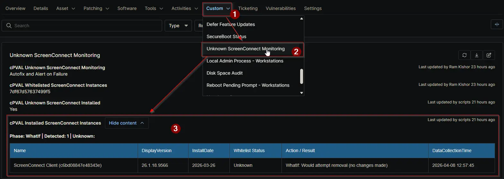

## Summary

This is a device-level WYSIWYG custom field that is automatically populated by the [Unknown ScreenConnect Monitoring](/docs/b3bbf754-fbdc-4034-8728-c52286746b1f) solution. It shows a table of all ScreenConnect instances detected on the device during each monitoring run.

Each row in the table includes the `instance name,` `installed version`, `install date`, `whitelist status`, `the action taken or result`, and the `timestamp when that row was recorded`.

The field is overwritten on every run and always reflects the current state of the device. *It is managed by the automation - **manual edits are not recommended** as they will be overwritten on the next execution.*

## Details

| Label | Field Name | Definition Scope | Type | Required | Default Value | Example | Technician Permission | Automation Permission | API Permission | Description | Tool Tip | Footer Text | Custom Field Tab Name |
| ----- | ---- | ---------------- | ---- | -------- | ------------- | --------------------- | --------------------- | -------------- | ----------- | -------- | ----------- | ----------- | ----------- |
| `cPVAL Installed ScreenConnect Instances` | `cpvalInstalledScreenconnectInstances` | `Device` | `WYSIWYG` | `False` | | | `Editable` | `Read_Write` | `Read_Write` | `Stores detailed results of ScreenConnect discovery on the device. This field is automatically populated by monitoring workflows and reflects current installation status and approval state.` | `Read-only output field showing detected ScreenConnect instances, their status, and any actions taken during auditing or remediation.` | `This field is system-managed and overwritten during each monitoring run. Manual edits are not recommended.` | `Unknown ScreenConnect Monitoring` |

### WYSIWYG Table Columns

| Column Name          | Description |
| -------------------- | ----------- |
| `Name`               | `Detected installed ScreenConnect Client display name.` |
| `DisplayVersion`     | `Installed version from uninstall registry details when available.` |
| `InstallDate`        | `Install date, normalized to yyyy-MM-dd when parseable.` |
| `Whitelist Status`   | `Whitelisted when identifier match is found; Unknown otherwise.` |
| `Action / Result`    | `Audit-only status, remediation attempt result, or post-remediation verification status.` |
| `DataCollectionTime` | `Timestamp when the report row was generated for the current script phase.` |

## Dependencies

- [Custom Field: cPVAL Unknown ScreenConnect Monitoring](/docs/ce85f694-4518-4e46-93e2-b008210e9627)
- [Custom Field: cPVAL Whitelisted ScreenConnect Instances](/docs/b190f460-afd9-4761-ad30-93094d15be2b)
- [Solution: Unknown ScreenConnect Monitoring](/docs/b3bbf754-fbdc-4034-8728-c52286746b1f)

## Custom Field Creation

- [Custom Field Configuration](https://github.com/ProVal-Tech/ninjarmm/blob/main/custom-fields/cpval-installed-screenconnect-instances.toml)

## Sample Screenshot

## Changelog

### 2026-04-09

- Initial version of the document
