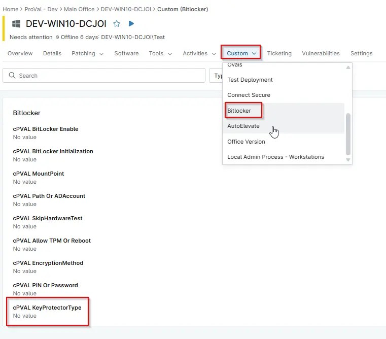

## Summary

Defines which BitLocker key protector method will be applied during encryption.

Parameter for BitLocker: 
- Tpm
- TpmPin (Requires PIN/Password)
- TpmStartup (Requires Path/ADAccount)
- TpmPinStartup (Requires PIN/Password and Path/ADAccount)
- Password (Requires PIN/Password)
- Startup (Requires Path/ADAccount )
- RecoveryKey (Requires Path/ADAccount)
- RecoveryPassword
- AdAccount (Requires Path/ADAccount)

## Details

| Label | Field Name | Definition Scope | Type | Required | Default Value | Technician Permission | Automation Permission | API Permission | Description | Tool Tip | Footer Text |  Custom Field Tab Name |
| ----- | ---- | ---------------- | ---- | -------- | ------------- | --------------------- | --------------------- | -------------- | ----------- | -------- | ----------- | ----------- |
| cPVAL KeyProtectorType | cpvalKeyprotectortype | `Organizations`,`Devices`,`Location` | Drop-down |  | `Tpm`, `TpmPin`, `TpmStartup`, `TpmPinStartup`, `Password`, `Startup`, `RecoveryKey`, `RecoveryPassword`, `AdAccount` | Editable | Read_Write | Read_Write | Defines which BitLocker key protector method will be applied during encryption. | Specifies the BitLocker key protector type used for securing the volume. | Defines which BitLocker key protector method will be applied during encryption. | BitLocker |

## Dependencies

- [Automation - Initialize BitLocker](/docs/e3a24552-f347-4117-82f5-7afaaa3fc198)
- [Solution - BitLocker Initialize - NinjaOne](/docs/2ebfabd5-05cf-4175-a513-2aa290eb26e8)

## Custom Field Creation

[Custom Field Configuration](https://github.com/ProVal-Tech/ninjarmm/blob/main/custom-fields/cpval-Key-protector-type.toml)

## Sample Screenshot

  
