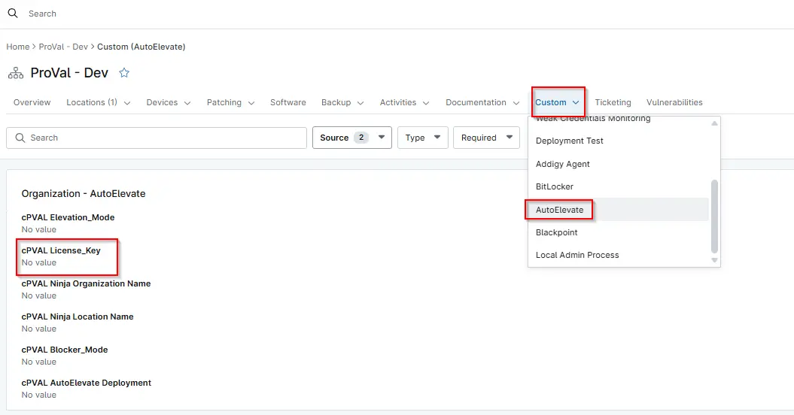

## Summary

License Key is a required parameter used during the AutoElevate agent deployment. It authorizes the agent to register with the correct AutoElevate tenant.

## Details

| Label                          | Field Name                 | Definition Scope | Type | Required | Default Value | Technician Permission | Automation Permission | API Permission | Description                             | Tool Tip | Footer Text | Custom Field Tab Name |
| ------------------------------ | -------------------------- | ---------------- | ---- | -------- | ------------- | --------------------- | --------------------- | -------------- | --------------------------------------- | -------- | ----------- | --------------------- |
| cPVAL License Key | cpvalLicensekey | `Organization`, `Location`, `Device`     | Multi-Line | Yes     | -             | Editable              | Read/Write            | Read/Write     | License Key is a required parameter used during the AutoElevate agent deployment. It authorizes the agent to register with the correct AutoElevate tenant.        | AutoElevate License Key is used for agent activation       | Required for installing and registering the AutoElevate agent.    | AutoElevate  |

## Dependencies

- [AutoElevate Agent Deployment](/docs/45b83c20-5a25-4321-a253-5239633ecbd4)
- [Solution Document - AutoElevate Deployment - NinjaOne](/docs/58fe4653-c2ac-49d3-bdf5-b8ba1e50f0c9)

## Custom Field Creation

- [Custom Field Configuration](https://github.com/ProVal-Tech/ninjarmm/blob/main/custom-fields/cpval-license-key.toml)

## Sample Screenshot

