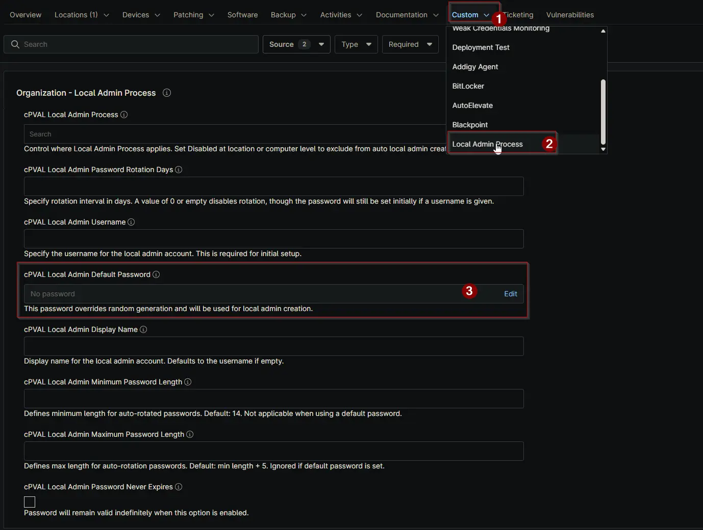

## Summary

Set the default password for the local admin in this field. If provided, the script will use this password instead of generating a random one during account creation.

## Details

| Label | Field Name | Definition Scope | Type | Required | Default Value | Example | Technician Permission | Automation Permission | API Permission | Description | Tool Tip | Footer Text |  Custom Field Tab Name |
| ----- | ---- | ---------------- | ---- | -------- | ------------- | --------------------- | --------------------- | -------------- | ----------- | ----------- | -------- | ----------- | ----------- |
| cPVAL Local Admin Username | cpvalLocalAdminDefaultPassword | <ul><li>Organization</li><li>Location</li><li>Device</li></ul> | Secure | False | | yourAdmin | Editable | Read_Write | Read_Write | Set the default password for the local admin in this field. If provided, the script will use this password instead of generating a random one during account creation. | Enter a default password for the local admin. If set, no random password will be generated. | This password overrides random generation and will be used for local admin creation. | <ul><li>Local Admin Process</li><li>Local Admin Process - Workstations</li><li>Local Admin Process - Servers</li></ul> |

## Dependencies

- [Solution: Windows - Local Admin - Process](/docs/11107cf4-cdb3-4d93-be1a-431ffbdce8da)

## Custom Field Creation

- [Custom Field Configuration](https://github.com/ProVal-Tech/ninjarmm/blob/main/custom-fields/cpval-local-admin-default-password.toml)

## Sample Screenshot

