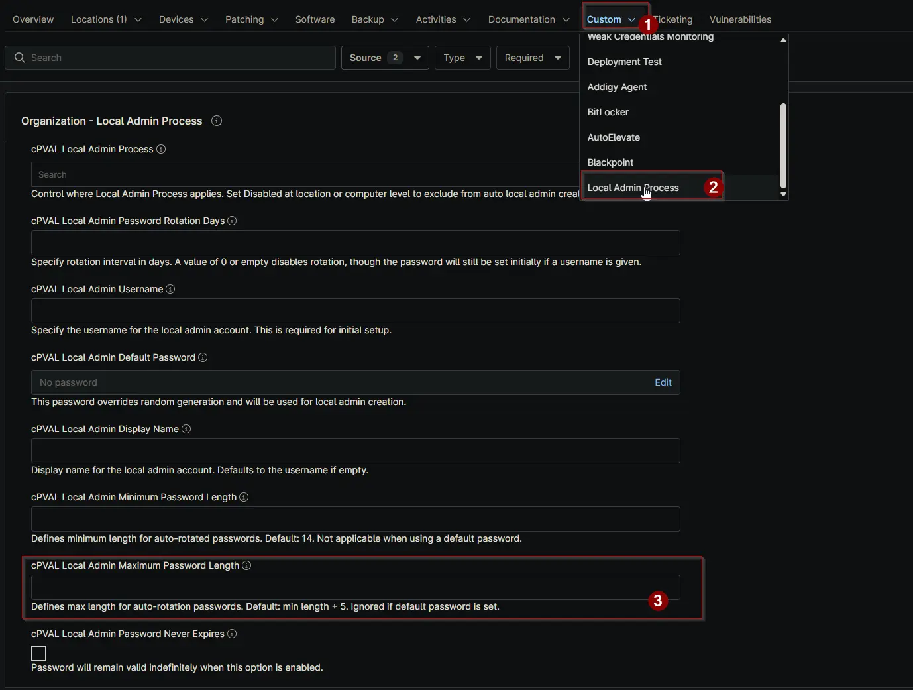

## Summary

Set the maximum password length for the local admin account. Applies only to auto-rotation. Ignored if a default password is set. Default: minimum length + 5 characters.

## Details

| Label | Field Name | Definition Scope | Type | Required | Default Value | Example | Technician Permission | Automation Permission | API Permission | Description | Tool Tip | Footer Text |  Custom Field Tab Name |
| ----- | ---- | ---------------- | ---- | -------- | ------------- | --------------------- | --------------------- | -------------- | ----------- | ----------- | -------- | ----------- | ----------- |
| cPVAL Local Admin Maximum Password Length | cpvalLocalAdminMaximumPasswordLength | <ul><li>Organization</li><li>Location</li><li>Device</li></ul> | Integer | False | 19 | 17 | Editable | Read_Write | Read_Write | Set the maximum password length for the local admin account. Applies only to auto-rotation. Ignored if a default password is set. Default: minimum length + 5 characters. | Maximum password length for auto-rotated passwords. Default is minimum length + 5. Not used when a default password is provided. | Defines max length for auto-rotation passwords. Default: min length + 5. Ignored if default password is set. | <ul><li>Local Admin Process</li><li>Local Admin Process - Workstations</li><li>Local Admin Process - Servers</li></ul> |

## Dependencies

- [Solution: Windows - Local Admin - Process](/docs/11107cf4-cdb3-4d93-be1a-431ffbdce8da)

## Custom Field Creation

- [Custom Field Configuration](https://github.com/ProVal-Tech/ninjarmm/blob/main/custom-fields/cpval-local-admin-maximum-password-length.toml)

## Sample Screenshot

