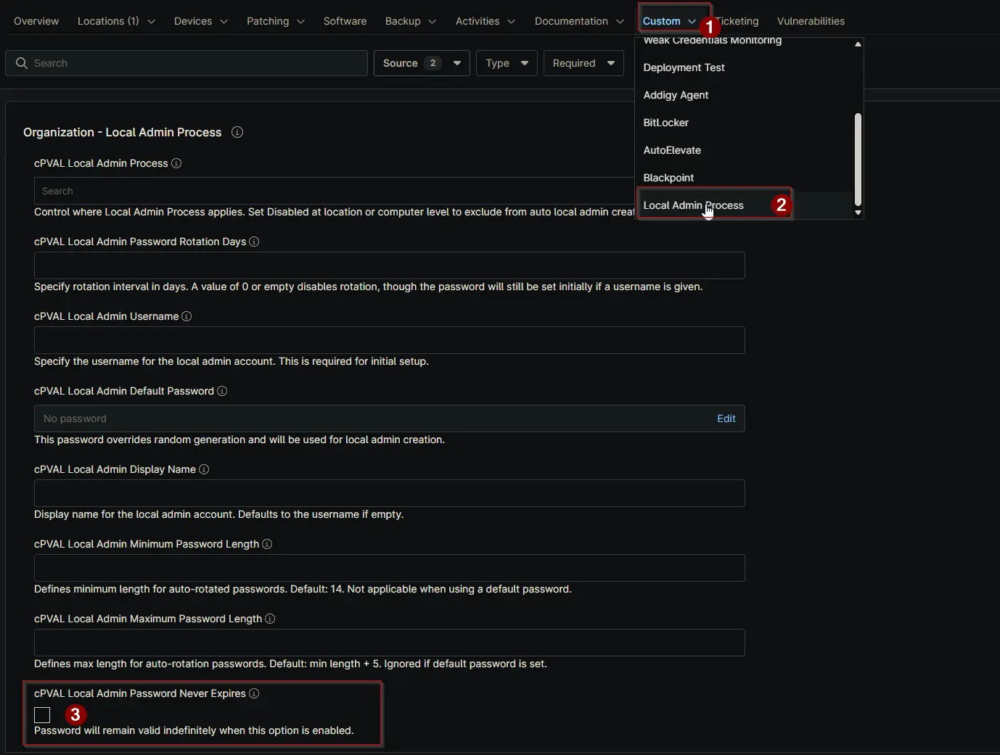

## Summary

Enable this option to set the local admin password to never expire. This setting ensures the password remains valid indefinitely unless manually changed.

## Details

| Label | Field Name | Definition Scope | Type | Required | Default Value | Example | Technician Permission | Automation Permission | API Permission | Description | Tool Tip | Footer Text |  Custom Field Tab Name |
| ----- | ---- | ---------------- | ---- | -------- | ------------- | --------------------- | --------------------- | -------------- | ----------- | ----------- | -------- | ----------- | ----------- |
| cPVAL Local Admin Password Never Expires | cpvalLocalAdminPasswordNeverExpires | <ul><li>Organization</li><li>Location</li><li>Device</li></ul> | Checkbox | False | False | | Editable | Read_Write | Read_Write | Enable this option to set the local admin password to never expire. This setting ensures the password remains valid indefinitely unless manually changed. | Sets the local admin password to never expire. | Password will remain valid indefinitely when this option is enabled. | <ul><li>Local Admin Process</li><li>Local Admin Process - Workstations</li><li>Local Admin Process - Servers</li></ul> |

## Dependencies

- [Solution: Windows - Local Admin - Process](/docs/11107cf4-cdb3-4d93-be1a-431ffbdce8da)

## Custom Field Creation

[Custom Field Configuration](https://github.com/ProVal-Tech/ninjarmm/blob/main/custom-fields/cpval-local-admin-password-never-expires.toml)

## Sample Screenshot

