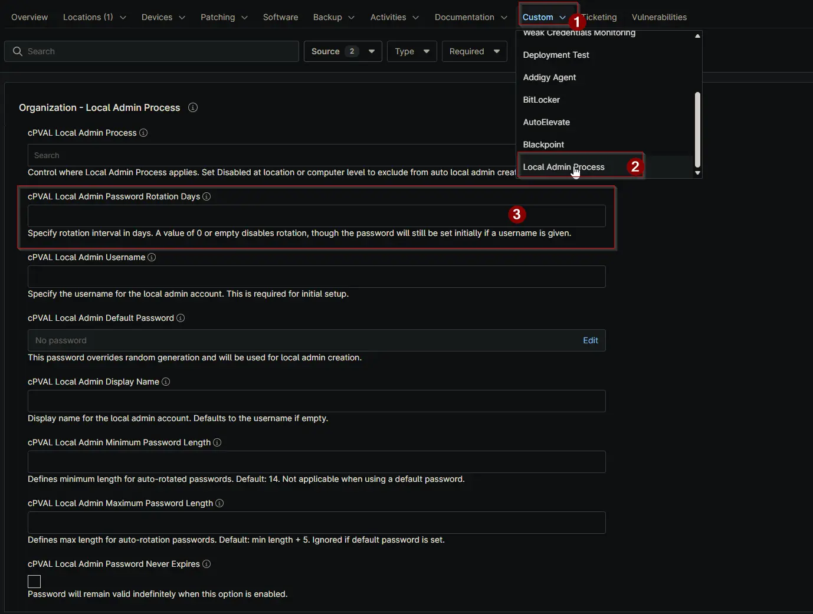

## Summary

Set the number of days for automatic password rotation. If this field is blank or set to 0, the Local Admin password will not rotate, but will be set initially if a username is provided.

## Details

| Label | Field Name | Definition Scope | Type | Required | Default Value | Example | Technician Permission | Automation Permission | API Permission | Description | Tool Tip | Footer Text |  Custom Field Tab Name |
| ----- | ---- | ---------------- | ---- | -------- | ------------- | --------------------- | --------------------- | -------------- | ----------- | ----------- | -------- | ----------- | ----------- |
| cPVAL Local Admin Password Rotation Day | cpvalLocalAdminPasswordRotationDays | <ul><li>Organization</li><li>Location</li><li>Device</li></ul> | Integer | True (To automatically change the password after X days). | | 90 | Editable | Read_Write | Read_Write | Set the number of days for automatic password rotation. If this field is blank or set to 0, the Local Admin password will not rotate, but will be set initially if a username is provided. | Define days for auto password rotation. If left blank or set to 0, rotation won't occur, but the password will be set once if a username exists. | Specify rotation interval in days. A value of 0 or empty disables rotation, though the password will still be set initially if a username is given. | <ul><li>Local Admin Process</li><li>Local Admin Process - Workstations</li><li>Local Admin Process - Servers</li></ul> |

## Dependencies

- [Solution: Windows - Local Admin - Process](/docs/11107cf4-cdb3-4d93-be1a-431ffbdce8da)

## Custom Field Creation

[Custom Field Configuration](https://github.com/ProVal-Tech/ninjarmm/blob/main/custom-fields/cpval-local-admin-password-rotation-days.toml)

## Sample Screenshot

