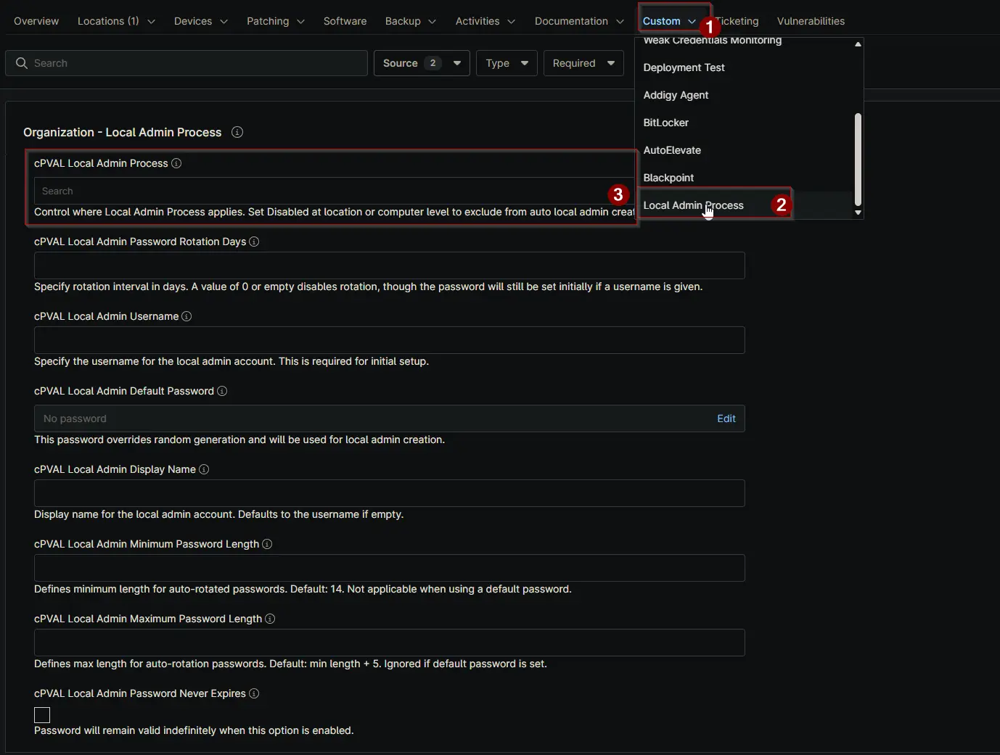

## Summary

Select the operating system to enable the [Windows - Local Admin - Process](/docs/11107cf4-cdb3-4d93-be1a-431ffbdce8da) solution. Choose `Disabled` at location or computer level to exclude that device or location from automatic local admin account creation.

## Details

| Label | Field Name | Definition Scope | Type | Required | Default Value | Options | Technician Permission | Automation Permission | API Permission | Description | Tool Tip | Footer Text |  Custom Field Tab Name |
| ----- | ---- | ---------------- | ---- | -------- | ------------- | --------------------- | --------------------- | -------------- | ----------- | ----------- | -------- | ----------- | ----------- |
| cPVAL Local Admin Process | cpvalLocalAdminProcess | <ul><li>Organization</li><li>Location</li><li>Device</li></ul> | Drop-down | True (To enables the solution automatically, though the main script can still run without this custom field). | | <ul><li>Disabled</li><li>Windows Workstation</li><li>Windows Server</li><li>Windows Workstation and Windows Server</li></ul> | Editable | Read_Write | Read_Write | Select the operating system to enable the 'Local Admin Process' solution. Choose Disabled at location or computer level to exclude that device or location from automatic local admin account creation. | Select an OS for the Local Admin Process. Use Disabled at location or computer level to prevent auto local admin creation. | Control where Local Admin Process applies. Set Disabled at location or computer level to exclude from auto local admin creation. | <ul><li>Local Admin Process</li><li>Local Admin Process - Workstations</li><li>Local Admin Process - Servers</li></ul> |

## Dependencies

- [Solution: Windows - Local Admin - Process](/docs/11107cf4-cdb3-4d93-be1a-431ffbdce8da)

## Custom Field Creation

[Custom Field Configuration](https://github.com/ProVal-Tech/ninjarmm/blob/main/custom-fields/cpval-local-admin-Process.toml)

## Sample Screenshot

