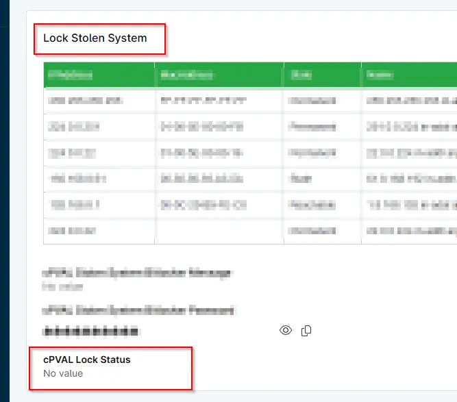

## Summary
This Custom Field is used by `Lock Stolen System` to mark Machine is successfully Locked and Bitlocker is enabled on the machine.

## Details

| Label | Field Name | Definition Scope | Type | Required | Default Value | Technician Permission | Automation Permission | API Permission | Description | Tool Tip | Footer Text |  Custom Field Tab Name |
| ----- | ---- | ---------------- | ---- | -------- | ------------- | --------------------- | --------------------- | -------------- | ----------- | -------- | ----------- | ----------- |
| cPVAL Lock Status | cpvalLockStatus | `Devices` | Text | No | |  Editable | Read_Write | Read_Write | This Custom Field is used by `Lock Stolen System` to mark Machine is successfully Locked and  Bitlocker is enabled on the machine. | Displays Machine is Locked and  Bitlocker is enabled on the machine. | Displays Machine is Locked and  Bitlocker is enabled on the machine. |

## Dependencies

- [Solution  - Lock Stolen System](/docs/13b4df99-df9b-4a57-bc0f-8675c68be028)

## Custom Field Creation

- [Custom Field Configuration](https://github.com/ProVal-Tech/ninjarmm/blob/main/custom-fields/cpval-lock-status.toml)

## Sample Screenshot

  