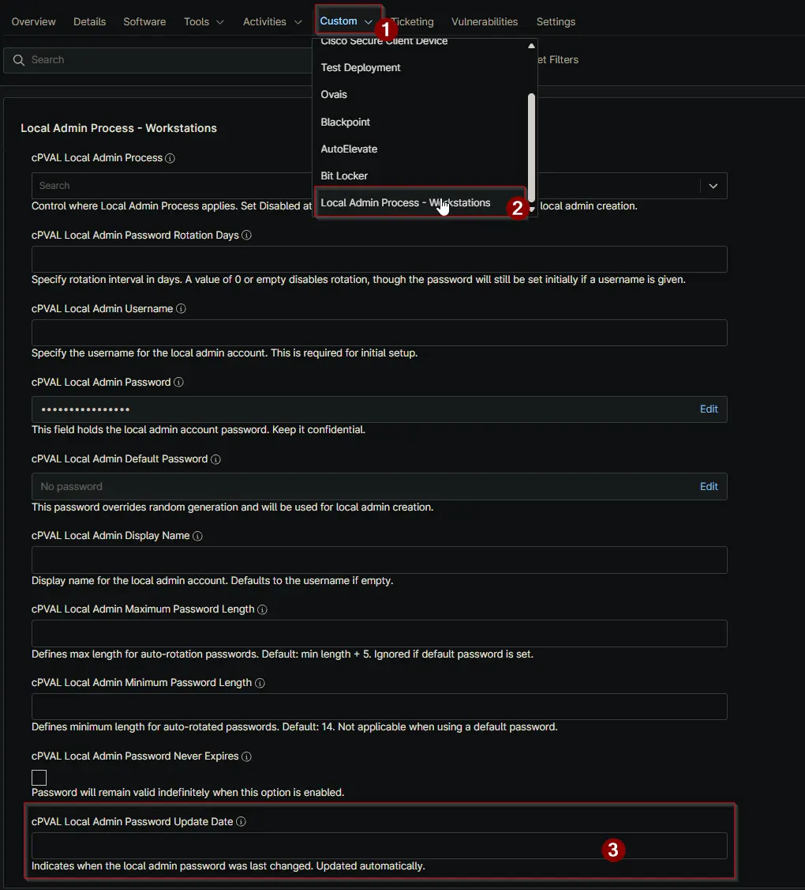

## Summary

Shows the last date a new password was set for the local admin account. This value is automatically updated by the script during password rotation.

> **Note:** *End user should not make any changes to this field manually.*\

## Details

| Label | Field Name | Definition Scope | Type | Required | Default Value | Example | Technician Permission | Automation Permission | API Permission | Description | Tool Tip | Footer Text |  Custom Field Tab Name |
| ----- | ---- | ---------------- | ---- | -------- | ------------- | --------------------- | --------------------- | -------------- | ----------- | ----------- | -------- | ----------- | ----------- |
| cPVAL Local Admin Password Update Date | cpvalLocalAdminPasswordUpdateDate | <ul><li>Device</li></ul> | Text | False | | | Editable | Read_Write | Read_Write | Shows the last date a new password was set for the local admin account. This value is automatically updated by the script during password rotation. | Last date the local admin password was updated. Managed by the script. | Indicates when the local admin password was last changed. Updated automatically. | <ul><li>Local Admin Process - Workstations</li><li>Local Admin Process - Servers</li></ul> |

## Dependencies

- [Solution: Windows - Local Admin - Process](/docs/11107cf4-cdb3-4d93-be1a-431ffbdce8da)

## Custom Field Creation

[Custom Field Configuration](https://github.com/ProVal-Tech/ninjarmm/blob/main/custom-fields/cpval-loval-admin-password-update-date.toml)

## Sample Screenshot

